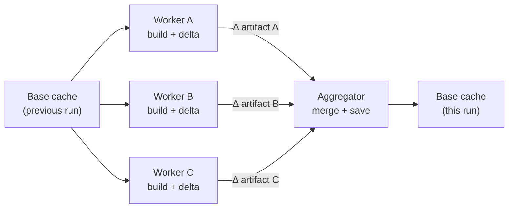

<!--
Copyright 2026 The Apache Software Foundation

Licensed under the Apache License, Version 2.0 (the "License");
you may not use this file except in compliance with the License.
You may obtain a copy of the License at

http://www.apache.org/licenses/LICENSE-2.0

Unless required by applicable law or agreed to in writing, software
distributed under the License is distributed on an "AS IS" BASIS,
WITHOUT WARRANTIES OR CONDITIONS OF ANY KIND, either express or implied.
See the License for the specific language governing permissions and
limitations under the License.
-->

Apache Buildish Mammoth Cache for Gradle is a CI action that caches the Gradle user home
(`GRADLE_USER_HOME`) across workflow runs and provisions Gradle wrapper JARs securely before
the build starts.

## Single-job mode

In the most common setup, the action wraps a single Gradle job: it restores the cache before the
build and saves an updated cache entry after the build. This avoids re-downloading dependencies and
re-compiling scripts on every run.

## Distributed multi-job mode

When a workflow runs multiple Gradle jobs in parallel — for example, one job per subproject or one
job per test suite — a naive shared cache has a fundamental problem: every parallel job writes back
its own version of the cache at the end, and the last writer wins. Jobs that finish earlier have
their dependency updates discarded because a later job overwrites the cache with whatever _it_ saw.

This action solves that with a **delta exchange** model:

- Each **worker job** computes only the _difference_ between what was in the cache when it started
  and what is in the cache after the build. It uploads that delta as a workflow artifact.
- A dedicated **aggregator job**, which runs after all workers complete, downloads every delta,
  merges them, and saves the merged result as the new base cache entry.

The result: every parallel job's dependency downloads and compilation outputs are captured in the
next cache entry, not just the last job to finish.

