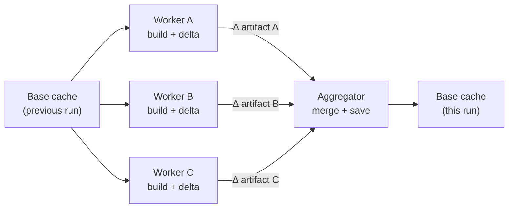

<!--
Copyright 2026 The Buildish Authors

Licensed under the Apache License, Version 2.0 (the "License");
you may not use this file except in compliance with the License.
You may obtain a copy of the License at

http://www.apache.org/licenses/LICENSE-2.0

Unless required by applicable law or agreed to in writing, software
distributed under the License is distributed on an "AS IS" BASIS,
WITHOUT WARRANTIES OR CONDITIONS OF ANY KIND, either express or implied.
See the License for the specific language governing permissions and
limitations under the License.
-->

Buildish Mammoth Cache for Gradle and Maven is a pair of CI actions that cache the build
tool's local artifact store across workflow runs:

- **Gradle** — caches `GRADLE_USER_HOME` and provisions Gradle wrapper JARs securely before the
  build starts.
- **Maven** — caches the Maven local repository (`~/.m2` by default).

Both actions share the same two-phase prepare/finalize lifecycle and support single-job and
distributed multi-job topologies.

## Single-job mode

In the most common setup, the action wraps a single build job: it restores the newest compatible
immutable generation before the build and publishes a new complete generation after a material
change. This avoids re-downloading dependencies on every run without creating duplicate entries for
unchanged runs.

## Distributed multi-job mode

When a workflow runs multiple build jobs in parallel — for example, one job per subproject or one
job per test suite — independent full-cache generations diverge. Restoring only the newest
generation then loses the dependency downloads that exist solely in the other workers' generations.

This action solves that with a **delta exchange** model:

- Each **worker job** computes only the _difference_ between what was in the cache when it started
  and what is in the cache after the build. It uploads that delta as a workflow artifact.
- A dedicated **aggregator job**, which runs after all workers complete, downloads every delta,
  merges them, and saves the merged result as the new base cache entry.

The result: every parallel job's dependency downloads are captured in one merged generation.

