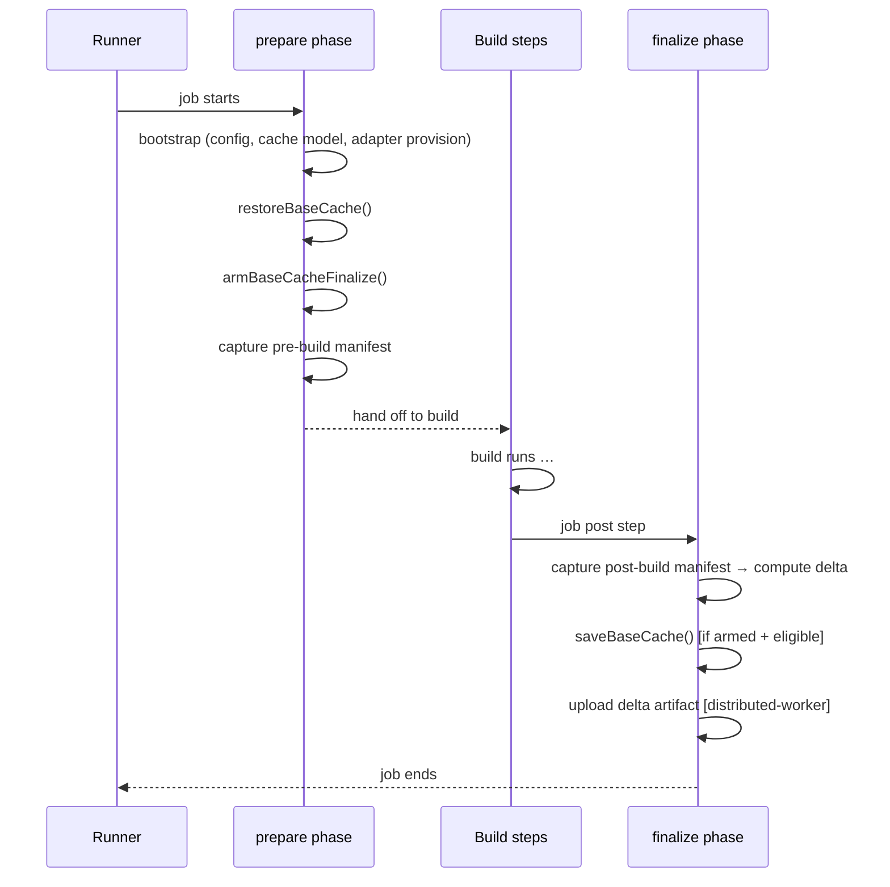
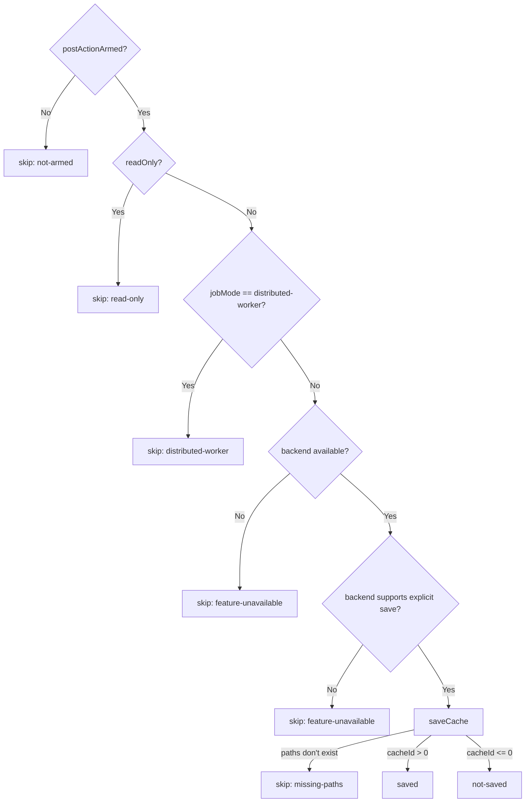
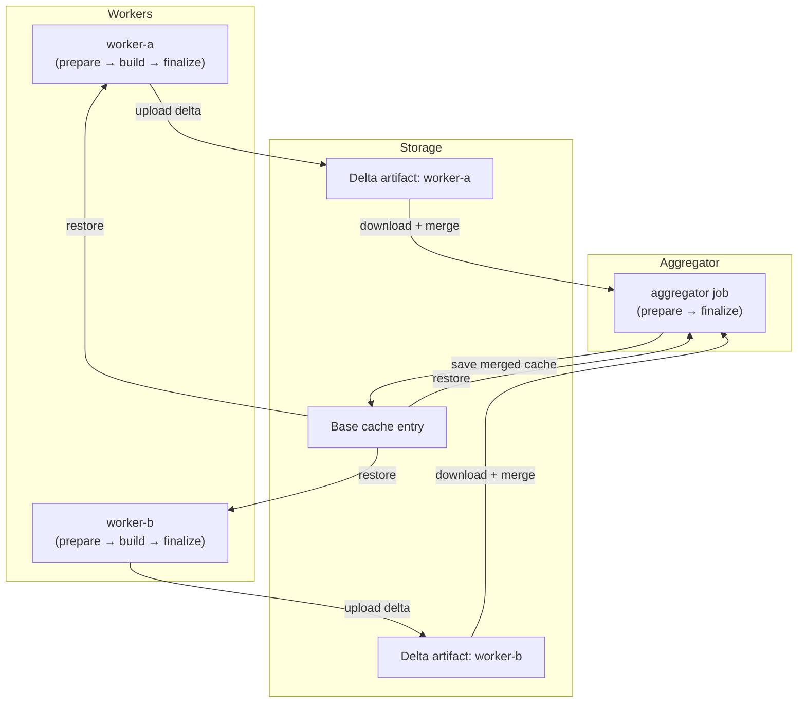

<!--
Copyright 2026 The Apache Software Foundation

Licensed under the Apache License, Version 2.0 (the "License");
you may not use this file except in compliance with the License.
You may obtain a copy of the License at

http://www.apache.org/licenses/LICENSE-2.0

Unless required by applicable law or agreed to in writing, software
distributed under the License is distributed on an "AS IS" BASIS,
WITHOUT WARRANTIES OR CONDITIONS OF ANY KIND, either express or implied.
See the License for the specific language governing permissions and
limitations under the License.
-->

This document describes the base cache restore/save lifecycle, the gating conditions that control
whether a save occurs, the optional `prune-managed` cleanup mode, and the distributed
worker/aggregator delta exchange model.

## Prepare / finalize lifecycle

The action splits its work across two entrypoints that run at different points in the workflow job.

State is passed between the two phases using the CI runtime state store (on GitHub Actions this is
`@actions/core` `saveState` / `getState`). The key state values are:

| State key                                 | Set by                  | Read by    | Purpose                                                   |
| ----------------------------------------- | ----------------------- | ---------- | --------------------------------------------------------- |
| `buildish-mammoth-cache-base-cache-armed` | `prepare` after restore | `finalize` | Gate on whether a save should be attempted                |
| pre-build manifest blob                   | `prepare`               | `finalize` | Delta computation between pre- and post-build snapshots   |
| base cache restore result                 | `prepare`               | `finalize` | Lets `finalize` know whether the restore was an exact-hit |
| consumed delta artifact names             | `prepare`               | `finalize` | Used when cleaning up consumed worker delta artifacts     |

## Base cache restore

`restoreBaseCache()` classifies the restore outcome into one of four statuses:

| Status                | Meaning                                                                        |
| --------------------- | ------------------------------------------------------------------------------ |
| `feature-unavailable` | The cache backend is not available (e.g. not a supported CI environment)       |
| `miss`                | No cache entry matched the primary key or any restore-key prefix               |
| `exact-hit`           | The primary key matched an existing entry exactly                              |
| `partial-hit`         | A restore-key prefix matched a cache entry from a different ref or earlier run |

Both `exact-hit` and `partial-hit` restore cache content to the build tool cache root. A
`partial-hit` restore does not suppress a later save — it is expected that the build will add or
modify files relative to the older cache snapshot.

## Base cache save gating

`saveBaseCache()` checks a sequence of conditions before writing to the cache:

Distributed worker jobs skip the base cache save intentionally: they only upload a delta artifact
that the aggregator merges. This prevents redundant and conflicting base cache writers.

## Prune-managed cleanup mode (`restore-cleanup-mode: prune-managed`)

This opt-in mode deletes managed files immediately after a base cache restore so the build starts
from a clean slice of the cache:

1. Detect whether the restore was a hit (`exact-hit` or `partial-hit`).
2. If no hit, skip cleanup and proceed normally.
3. If a hit, delete every file currently matched by the active partition include globs within
   the build tool cache root. Files outside the managed partition space are left untouched.
4. Re-restore the base cache using the same key and paths.
5. If the follow-up restore misses, the action fails rather than starting the build with a
   partially pruned managed cache space.

This mode is narrower than "delete everything outside the include patterns": it only removes files
it would normally manage. It is most useful when you want to guarantee that stale managed files
from previous runs do not accumulate on long-lived runners.

## Distributed delta exchange

The distributed worker/aggregator model separates cache writing from parallel build execution.

**Worker jobs** (`job-mode: distributed-worker`):

- Restore the base cache.
- Run the build.
- Compute the delta between the pre- and post-build manifest snapshots.
- Pack only changed or added files into a delta artifact package and upload it.
- Skip the base cache save step.

**Aggregator jobs** (`job-mode: distributed-aggregator`):

- Restore the base cache.
- Download all delta artifact packages from the listed `dependent-jobs`.
- Merge the deltas in dependency order, applying the most recent version of each file.
- Apply the merged delta to the build tool cache root.
- Save the resulting cache root as the new base cache entry.

Delta packages are identified by a combination of the producing job name, the run number, and the
run attempt. This identity triple ensures that a re-run of a failed worker does not cause the
aggregator to pick up a stale artifact from the previous attempt.

The artifact package includes an integrity manifest (SHA-256 hashes for each file), a schema
version field, and a metadata section describing the producer job. The schema version is checked at
download time to detect incompatible format changes.

The delta computation and merge logic lives in `src/delta/apply.ts`. The artifact staging, upload,
and download logic lives in `src/delta/service.ts`.

### Artifact uniqueness constraint

A delta artifact name is derived from the job name and schema version. Within a workflow run, each
worker job must have a unique name so that its artifact does not collide with another worker's
artifact in the same run. The CI backend is responsible for enforcing artifact name uniqueness
within a run; this action relies on that guarantee.
