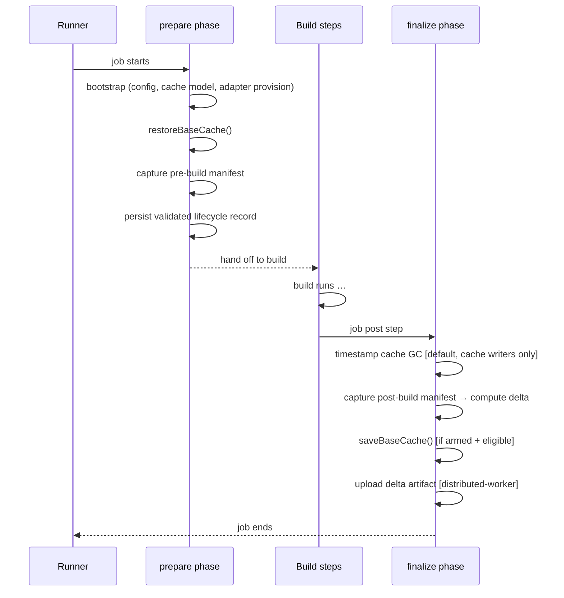
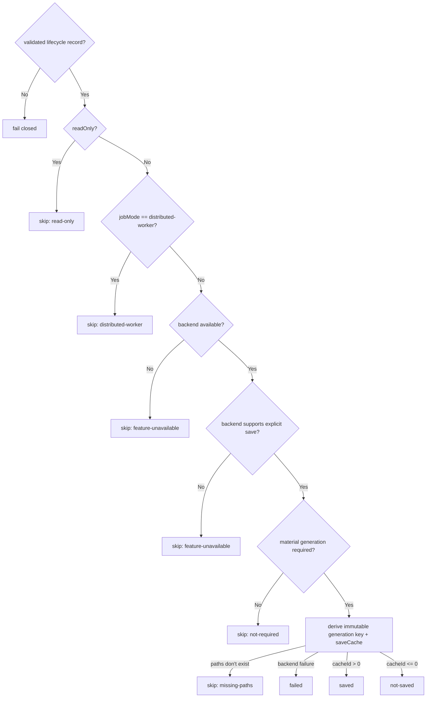
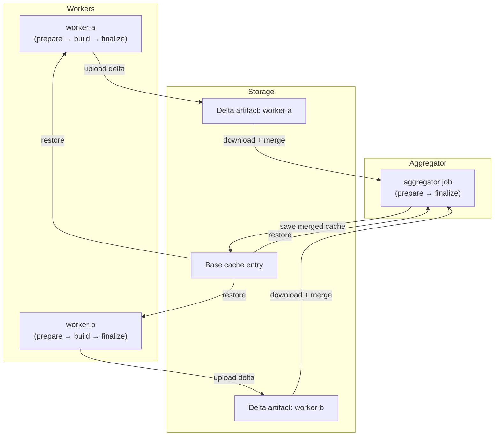

<!--
Copyright 2026 The Buildish Authors

Licensed under the Apache License, Version 2.0 (the "License");
you may not use this file except in compliance with the License.
You may obtain a copy of the License at

http://www.apache.org/licenses/LICENSE-2.0

Unless required by applicable law or agreed to in writing, software
distributed under the License is distributed on an "AS IS" BASIS,
WITHOUT WARRANTIES OR CONDITIONS OF ANY KIND, either express or implied.
See the License for the specific language governing permissions and
limitations under the License.
-->

This document describes the base cache restore/save lifecycle, the gating conditions that control
whether a save occurs, timestamp garbage collection, the optional `prune-managed` cleanup mode, and
the distributed worker/aggregator delta exchange model.

## Prepare / finalize lifecycle

The action splits its work across two entrypoints that run at different points in the workflow job.

State is passed between the two phases using the CI runtime state store (on GitHub Actions this is
`@actions/core` `saveState` / `getState`). Cache-enabled prepare persists one validated lifecycle
record rather than independent identity fragments:

| Cache state                     | Set by    | Read by    | Purpose                                                                      |
| ------------------------------- | --------- | ---------- | ---------------------------------------------------------------------------- |
| cache lifecycle record          | `prepare` | `finalize` | Family, lineages, restore result, generation seed, execution, and delta data |
| record manifest path and digest | `prepare` | `finalize` | Canonical before/after comparison with tamper and drift detection            |

Finalize recomputes the cache model and refuses to write if its schema, build tool, family, or
lineages differ from the prepare record. A missing or malformed record is also fatal for a
cache-enabled finalize; the action never guesses a save identity from partial state.

## Base cache restore

`restoreBaseCache()` classifies the restore outcome into one of four statuses:

| Status                 | Meaning                                                                 |
| ---------------------- | ----------------------------------------------------------------------- |
| `feature-unavailable`  | Backend unavailable or lacks newest-prefix restore                      |
| `miss`                 | No generation matched the current or default-branch lineage             |
| `current-lineage-hit`  | The newest accessible current-ref generation was restored               |
| `fallback-lineage-hit` | The current lineage missed and the newest default-branch generation hit |

Both hit statuses restore a complete immutable generation to the build tool cache root. A later
writable save uses a new generation key; it never attempts to overwrite the restored entry.

## Base cache save gating

`saveBaseCache()` checks a sequence of conditions before writing to the cache:

Distributed worker jobs skip the base cache save intentionally: they only upload a delta artifact
that the aggregator merges. This prevents redundant and conflicting base cache writers.

A writable standalone or aggregator job publishes a generation only when the managed state is
materially new: a non-empty restore miss, a canonical pre/post manifest difference, or applied
dependent-delta mutations. An unchanged cache hit returns `not-required` and does not call the
backend. Empty cold starts are likewise not saved.

Standalone backend failures are prominent warnings so the build result remains usable. Aggregator
save failures are fatal because the merged distributed result has not become durable. Reports name
a generation as published only after the backend returns a successful cache ID.

## Bounded manifest scanning

Content-manifest capture and metadata-only garbage-collection scans share one expandable work queue
per include root. The queue runs at most 32 filesystem tasks concurrently, including directory
inspection and file hashing. It does not create one promise or open file stream for every directory
entry in a broad cache tree.

Traversal completion order does not affect the contract: entries are sorted by normalized relative
path before the manifest is returned, and canonical digest fields are unchanged. The bound protects
runner file descriptors and reduces transient allocation; it is not a total cache-size or manifest
cardinality limit.

## Timestamp cache garbage collection

`cache-gc-mode: timestamp` runs by default during finalize before the base cache is saved by
standalone and distributed-aggregator jobs. It is designed to counter unbounded cache growth in
GitHub Actions cache entries, especially Maven local repositories, without slowing the pre-build
restore path.

The GC pass captures managed cache file metadata without hashing file contents, then deletes only
managed files whose modification time and effective access time are both older than
`cache-gc-older-than-days` (`14` by default).
Effective access time is `max(atime, mtime)`, so recently written files are kept even if filesystem
access-time behavior is stale, deferred, or disabled. The minimum supported cutoff is `2` days to
avoid treating Linux `relatime`-style updates as precise same-day usage data.

Distributed-worker jobs skip this GC pass because they produce delta artifacts rather than saving
the base cache. After deleting eligible files, the pass removes empty parent directories. Before
deleting a file, GC resolves the cache-relative path under the cache root and rechecks that the
target is a regular non-symlink file. Because this runs before post-build manifest capture, deleted
files are reflected naturally in the finalized cache state and any cache statistics.

Operators can disable this behavior with `cache-gc-mode: off` or increase
`cache-gc-older-than-days` when a build intentionally depends on old, rarely touched cache entries.

## Prune-managed cleanup mode (`restore-cleanup-mode: prune-managed`)

This opt-in mode deletes managed files immediately after a base cache restore so the build starts
from a clean slice of the cache:

1. Detect whether the restore was a hit (`current-lineage-hit` or `fallback-lineage-hit`).
2. If no hit, skip cleanup and proceed normally.
3. If a hit, delete every file currently matched by the active partition include globs within
   the build tool cache root. Files outside the managed partition space are left untouched.
4. Re-restore using the same ordered lineage candidates and paths.
5. If the follow-up restore misses, the action fails rather than starting the build with a
   partially pruned managed cache space.

This mode is narrower than "delete everything outside the include patterns": it only removes files
it would normally manage. It is most useful when you want to guarantee that stale managed files
from previous runs do not accumulate on long-lived runners.

## Distributed delta exchange

The distributed worker/aggregator model separates cache writing from parallel build execution.

**Worker jobs** (`job-mode: distributed-worker`):

- Restore the base cache.
- Run the build.
- Compute the delta between the pre- and post-build manifest snapshots.
- Pack only changed or added files into a delta artifact package and upload it.
- Skip the base cache save step.
- In read-only mode, skip artifact staging and upload as well.

**Aggregator jobs** (`job-mode: distributed-aggregator`):

- Restore the base cache.
- Download all delta artifact packages from the listed `dependent-jobs`.
- Merge the deltas in dependency order, applying the most recent version of each file.
- Apply the merged delta to the build tool cache root.
- Save the resulting cache root as the new base cache entry.
- In read-only mode, perform no artifact discovery, download, validation, apply, or deletion and
  return `skipped-read-only`.

Delta packages carry producing job, run, attempt, source revision, cache family, lineage, restored
generation, pre-build manifest digest, runner, and partition identity. The aggregator selects the
highest unambiguous producer attempt not newer than its own, enabling safe full, failed-job, and
aggregator-only reruns without crossing workflow run IDs.

The artifact package includes an integrity manifest (SHA-256 hashes for each file), a schema
version field, and a metadata section describing the producer job. The schema version is checked at
download time to detect incompatible format changes.

The delta computation and merge logic lives in `src/delta/apply.ts`. The artifact staging, upload,
and download logic lives in `src/delta/service.ts`.

### Artifact uniqueness constraint

A delta artifact name is derived from the job name and schema version. Within a workflow run, each
worker job must have a unique name so that its artifact does not collide with another worker's
artifact in the same run. The CI backend is responsible for enforcing artifact name uniqueness
within a run; this action relies on that guarantee.
