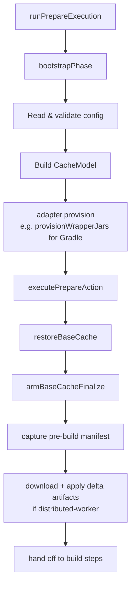
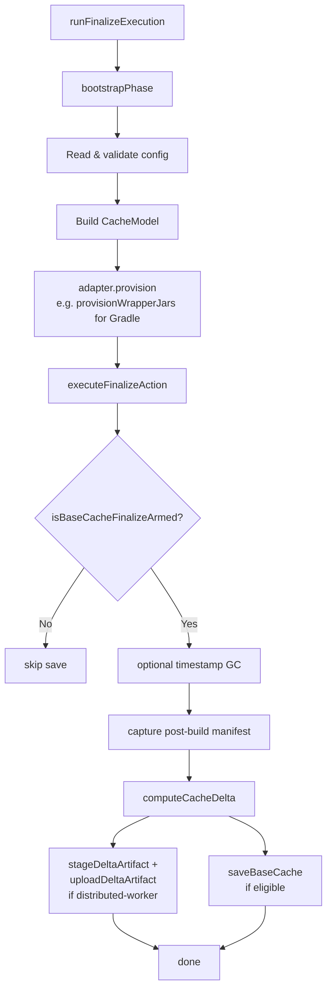

<!--
Copyright 2026 The Buildish Authors

Licensed under the Apache License, Version 2.0 (the "License");
you may not use this file except in compliance with the License.
You may obtain a copy of the License at

http://www.apache.org/licenses/LICENSE-2.0

Unless required by applicable law or agreed to in writing, software
distributed under the License is distributed on an "AS IS" BASIS,
WITHOUT WARRANTIES OR CONDITIONS OF ANY KIND, either express or implied.
See the License for the specific language governing permissions and
limitations under the License.
-->

The bootstrap process runs at the start of every phase (prepare and finalize). It resolves
configuration, builds the cache model, and runs the build tool adapter's bootstrap step — all
before any cache-specific logic runs. The adapter step is tool-specific: for Gradle it provisions
wrapper JARs; for Maven it is a no-op in v1.

## Entrypoints

The two CI-facing entrypoints call into the shared phase logic:

| Phase    | CI entrypoint                | Phase entry function     |
| -------- | ---------------------------- | ------------------------ |
| prepare  | `src/phases/prepare/cli.ts`  | `runPrepareExecution()`  |
| finalize | `src/phases/finalize/cli.ts` | `runFinalizeExecution()` |

Both entry functions call `bootstrapPhase()` from `src/phases/bootstrap.ts` as their first step.

## Prepare phase



**`bootstrapPhase()`** (`src/phases/bootstrap.ts`):

1. Reads action inputs (via `HostInputSource`).
2. Optionally loads and merges a config file.
3. Validates and normalizes the merged config with Zod.
4. Detects the Java major version by running `java -version`.
5. Constructs the `CacheModel` (`src/cache/model.ts`): partition definitions, cache keys, path
   calculations.
6. Calls the build tool adapter's `provision()` method. For Gradle this runs
   `provisionWrapperJars()` (`src/build-tool/gradle/wrapper/download.ts`) to download, verify, and
   install any missing `gradle-wrapper.jar` files. For Maven this is a no-op in v1.

**`executePrepareAction()`** (`src/phases/prepare/flow.ts`):

1. Calls `restoreBaseCache()` which classifies the outcome as a miss, current-lineage hit, or
   default-branch fallback hit.
2. If restore-cleanup mode is `prune-managed`, deletes managed files and re-restores.
3. Arms the finalize phase via `armBaseCacheFinalize()` (writes a state flag so the finalize phase
   knows a restore was attempted).
4. For `distributed-aggregator` jobs with configured `dependent-jobs`, downloads and applies
   applicable delta artifact packages.
5. Captures the pre-build file snapshot (`captureCacheManifest()`).

## Finalize phase



**`executeFinalizeAction()`** (`src/phases/finalize/flow.ts`):

1. Loads persisted prepare-phase state, including the pre-build manifest and finalize arm flag.
2. Runs timestamp cache garbage collection for standalone and distributed-aggregator jobs when
   `cache-gc-mode` is `timestamp`.
3. Captures the post-build file snapshot.
4. Calls `computeCacheDelta()` (`src/cache/manifest.ts`) to diff pre- and post-build manifests.
5. For `distributed-worker`: stages the delta artifact locally, then uploads it.
6. Calls `saveBaseCache()` (skipped for `distributed-worker`; see [Base Cache Design](../base-cache/)).
7. For `distributed-aggregator`: cleans up consumed worker delta artifacts.

## Configuration loading

The full priority order for action configuration:

```
Action input overrides
        ↓
Config-file values (workspace-relative .yml / .json / .yaml)
        ↓
Built-in defaults
```

Validation is performed after merging all layers using the tool-specific normalizer
(`src/build-tool/gradle/config.ts` or `src/build-tool/maven/config.ts`).
If any value is invalid, the action fails at bootstrap before touching the cache or wrappers.

## Cache model

The `CacheModel` (`src/cache/model.ts`) is constructed once during bootstrap and passed through the
whole phase. It encapsulates:

- The resolved build tool cache root path (e.g. `GRADLE_USER_HOME` for Gradle, `~/.m2` for Maven).
- The active partition list with their computed include/exclude globs.
- The action-owned compatibility family key.
- The collision-resistant current ref token and lineage prefix.
- The ordered default-branch fallback lineage, when applicable.
- The planned immutable generation identifier.
- The computed `partitionFingerprint`.

The `CacheModel` is intentionally immutable after construction so that both phases see exactly the
same partition layout and key values.
