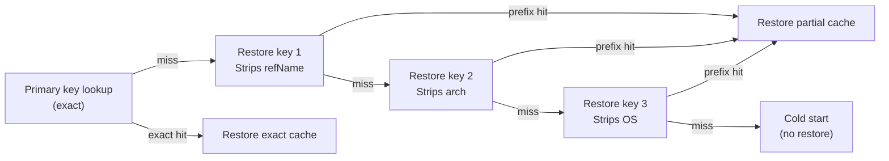

<!--
Copyright 2026 The Apache Software Foundation

Licensed under the Apache License, Version 2.0 (the "License");
you may not use this file except in compliance with the License.
You may obtain a copy of the License at

http://www.apache.org/licenses/LICENSE-2.0

Unless required by applicable law or agreed to in writing, software
distributed under the License is distributed on an "AS IS" BASIS,
WITHOUT WARRANTIES OR CONDITIONS OF ANY KIND, either express or implied.
See the License for the specific language governing permissions and
limitations under the License.
-->

## Primary cache key

The primary key uniquely identifies the expected exact cache state for a build. It is computed from
the rendered `cache-key-template`, which defaults to:

```
${cacheKeyPrefix}-v${schemaVersion}-${partitionFingerprint}-${javaMajor}-${runnerOs}-${runnerArch}-${refName}
```

| Placeholder               | Value                                                                                                                           |
| ------------------------- | ------------------------------------------------------------------------------------------------------------------------------- |
| `${cacheKeyPrefix}`       | `cache-key-prefix` input (default: tool-specific — `buildish-mammoth-gradle-cache-` or `buildish-mammoth-maven-cache-`)         |
| `${schemaVersion}`        | Internal cache schema version bump (per-tool constant in `src/build-tool/gradle/config.ts` or `src/build-tool/maven/config.ts`) |
| `${partitionFingerprint}` | 16-character SHA-256 digest of the full ordered partition layout                                                                |
| `${javaMajor}`            | Major Java version reported by `java -version`                                                                                  |
| `${runnerOs}`             | OS identifier from the CI environment                                                                                           |
| `${runnerArch}`           | Architecture identifier from the CI environment                                                                                 |
| `${refName}`              | Git ref name (e.g. `main`, `refs/pull/42/merge`)                                                                                |

A custom `cache-key-template` must include `${partitionFingerprint}`. This is enforced at
configuration load time so that changing the active partition layout always produces a new cache key.

## Restore keys

When the primary key misses, the action attempts restore-key prefix lookups in order from most to
least specific. The restore key sequence is derived from the primary key by dropping one suffix at
a time:



This sequence means that a PR branch can fall back to a cache entry from `main` on the same runner
type, and a new runner architecture can fall back to an older entry from the same OS. The narrower
the match, the better — a `partial-hit` restore still gives the build a warm cache, but a later
save will likely update it.

## Partition fingerprint

The `partitionFingerprint` is a 16-character hex prefix of the SHA-256 of the ordered, serialized
list of all active partitions (including their id, includes, excludes, and hard excludes). It
changes whenever:

- A built-in partition is enabled, disabled, or overridden.
- A custom partition is added or removed.
- The include or exclude globs for any active partition change.
- The global `HARD_CACHE_EXCLUDE_GLOBS` list changes.

Because the fingerprint is part of the default key template, layout changes automatically create a
new cache key lineage without requiring a manual schema version bump.

## Custom key templates

If the built-in restore-key sequence does not match your workflow topology, you can specify a
custom `cache-key-template`. The template may reference only the placeholders listed above.
`${partitionFingerprint}` is required. All other placeholders are optional.

Example — single-OS project wanting broader cross-ref fallback:

```
${cacheKeyPrefix}-v${schemaVersion}-${partitionFingerprint}-${javaMajor}-${refName}
```

This drops the OS and arch components, so a `main` cache entry can be used as a fallback for any
OS/arch combination, which may or may not be appropriate depending on whether your build produces
platform-specific artifacts inside the build tool cache directory.
