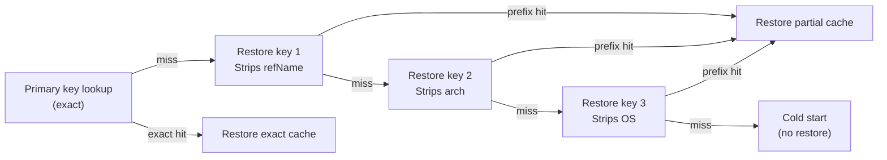

<!--
Copyright 2026 The Apache Software Foundation

Licensed under the Apache License, Version 2.0 (the "License");
you may not use this file except in compliance with the License.
You may obtain a copy of the License at

http://www.apache.org/licenses/LICENSE-2.0

Unless required by applicable law or agreed to in writing, software
distributed under the License is distributed on an "AS IS" BASIS,
WITHOUT WARRANTIES OR CONDITIONS OF ANY KIND, either express or implied.
See the License for the specific language governing permissions and
limitations under the License.
-->

## Primary cache key

The primary key uniquely identifies the expected exact cache state for a build. It is computed from
the rendered `cache-key-template`, which defaults to:

```
${cacheKeyPrefix}-v${schemaVersion}-${partitionFingerprint}-${javaMajor}-${runnerOs}-${runnerArch}-${refName}
```

| Placeholder               | Value                                                                                                                           |
| ------------------------- | ------------------------------------------------------------------------------------------------------------------------------- |
| `${cacheKeyPrefix}`       | `cache-key-prefix` input (default: tool-specific — `buildish-mammoth-gradle-cache-` or `buildish-mammoth-maven-cache-`)         |
| `${schemaVersion}`        | Internal cache schema version bump (per-tool constant in `src/build-tool/gradle/config.ts` or `src/build-tool/maven/config.ts`) |
| `${partitionFingerprint}` | 16-character SHA-256 digest of the full ordered partition layout                                                                |
| `${javaMajor}`            | Major Java version reported by `java -version`                                                                                  |
| `${runnerOs}`             | OS identifier from the CI environment                                                                                           |
| `${runnerArch}`           | Architecture identifier from the CI environment                                                                                 |
| `${refName}`              | Git ref name (e.g. `main`, `refs/pull/42/merge`)                                                                                |

A custom `cache-key-template` must include `${partitionFingerprint}`. This is enforced at
configuration load time so that changing the active partition layout always produces a new cache key.

## Restore keys

When the primary key misses, the action attempts restore-key prefix lookups in order from most to
least specific. The restore key sequence is derived from the primary key by dropping one suffix at
a time:



This sequence means that a PR branch can fall back to a cache entry from `main` on the same runner
type, and a new runner architecture can fall back to an older entry from the same OS. The narrower
the match, the better — a `partial-hit` restore still gives the build a warm cache, but a later
save will likely update it.

## Partition fingerprint

The `partitionFingerprint` is a 16-character hex prefix of the SHA-256 of the ordered, serialized
list of all active partitions (including their id, includes, excludes, and hard excludes). It
changes whenever:

- A built-in partition is enabled, disabled, or overridden.
- A custom partition is added or removed.
- The include or exclude globs for any active partition change.
- The global `HARD_CACHE_EXCLUDE_GLOBS` list changes.

Because the fingerprint is part of the default key template, layout changes automatically create a
new cache key lineage without requiring a manual schema version bump.

## Custom key templates

If the built-in restore-key sequence does not match your workflow topology, you can specify a
custom `cache-key-template`. The template may reference only the placeholders listed above.
`${partitionFingerprint}` is required. All other placeholders are optional.

Example — single-OS project wanting broader cross-ref fallback:

```
${cacheKeyPrefix}-v${schemaVersion}-${partitionFingerprint}-${javaMajor}-${refName}
```

This drops the OS and arch components, so a `main` cache entry can be used as a fallback for any
OS/arch combination, which may or may not be appropriate depending on whether your build produces
platform-specific artifacts inside the build tool cache directory.

---

## Rationale for each key component

Understanding _why_ each component is in the default key helps you decide whether to keep or
drop it in a custom template.

**`${cacheKeyPrefix}`**
Namespaces the cache so that unrelated workflows or projects that share a cache backend do not
collide. The default prefix includes the tool name (`buildish-mammoth-gradle-cache-` or
`buildish-mammoth-maven-cache-`), which also prevents a Gradle cache from being mistaken for a
Maven cache. If you run multiple independent build jobs in the same repository and want them to
share a common base cache, give them the same prefix — but be aware that they must also agree
on partition layout (otherwise the fingerprint will differ and they will each keep their own
lineage).

**`${schemaVersion}`**
An internal counter that is incremented whenever the structure of what gets cached changes in a
way that could cause a stale restore to break a build (for example, if a previously cached file
is now in a different location). This is distinct from the `${partitionFingerprint}`: the schema
version protects against internal format changes that users do not control; the fingerprint
protects against user-controlled partition changes.

**`${partitionFingerprint}`**
Ensures that adding, removing, or adjusting a cache partition immediately produces a new key
lineage rather than restoring an entry that was built with a different partition layout and might
therefore contain stale or missing files. See the [Partition fingerprint](#partition-fingerprint)
section above.

**`${javaMajor}`**
Gradle and Maven both compile plugin code and resolve version constraints with the active JVM.
The internal format of some cached artifacts (for example, Gradle's daemon registry or certain
build tool resolver caches) can differ across major Java versions. Separating the cache by major
version avoids subtle compatibility problems when a project is built with Java 17 one day and
Java 21 the next.

**`${runnerOs}` and `${runnerArch}`**
Native binaries, platform-specific ZIP distributions, and OS-dependent path separators all mean
that a Gradle or Maven cache populated on Linux is unsafe to restore on macOS or Windows.
Separating by OS and architecture keeps the cache coherent. If your project has a single-OS
matrix and you know nothing in the cache directory is platform-specific, dropping these
components from a custom template widens the restore key fallback without risk.

**`${refName}`**
Branch-scoped caching prevents long-lived topic branches from polluting the `main` cache, and
prevents ephemeral PR branches from over-writing the default-branch baseline. The default
restore key sequence falls back from the exact `${refName}` match to progressively broader
prefixes, so PR branches can warm-start from the latest `main` entry without ever saving back
to it.

---

## Cache hit rate considerations

A few patterns that commonly affect hit rates in practice:

**Matrix jobs** — each matrix dimension that produces different cached content should be
reflected in the key. If you have a Java-version matrix and the two JVM versions would produce
incompatible entries, keep `${javaMajor}`. If the versions are compatible and you want cache
sharing across them, drop it from a custom template.

**PR-branch caching** — the default restore key sequence lets PR branches inherit the latest
`main` entry as a partial hit. On the first PR build the restore gives a warm but stale cache;
Mammoth Cache then saves the updated entry scoped to the PR's ref. Subsequent builds on the
same PR hit the PR-scoped entry exactly. When the PR is merged, `main` builds save a fresh
entry that in turn warms the next PR.

**Re-runs and attempt number** — the primary cache key does not include the run ID or attempt
number. This means a re-run on the same branch with the same partition layout gets the same
primary key and hits the same cache entry. The delta-exchange protocol (see
[Delta Exchange Protocol](../delta-protocol/)) does include the attempt number in artifact
names, which prevents a re-run from colliding with a previous run's artifacts.

**Cold starts** — a cold start (no entry at any restore key depth) means the build downloads
everything from the network. On the next run the primary key saves a full cache entry and
subsequent runs hit exactly. The restore key sequence can shorten how often a project goes cold:
a new branch that shares `${partitionFingerprint}`, `${javaMajor}`, and runner identity with
`main` will always find at least one restore key entry.
