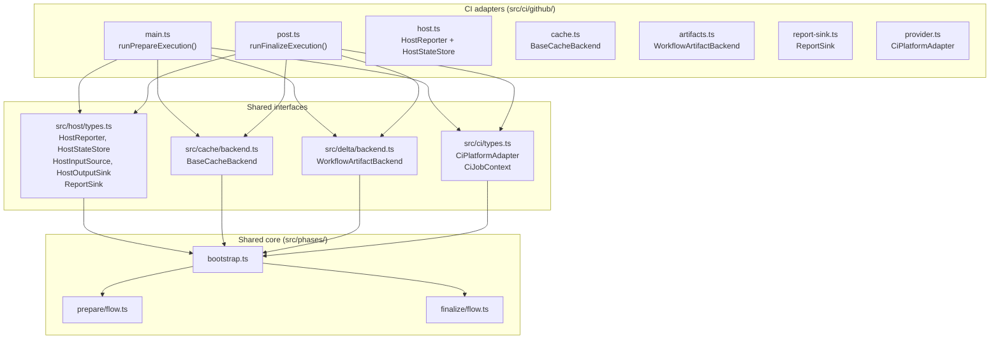

<!--
Copyright 2026 The Apache Software Foundation

Licensed under the Apache License, Version 2.0 (the "License");
you may not use this file except in compliance with the License.
You may obtain a copy of the License at

http://www.apache.org/licenses/LICENSE-2.0

Unless required by applicable law or agreed to in writing, software
distributed under the License is distributed on an "AS IS" BASIS,
WITHOUT WARRANTIES OR CONDITIONS OF ANY KIND, either express or implied.
See the License for the specific language governing permissions and
limitations under the License.
-->

## Overview

The action is built around a strict boundary between CI-platform-specific adapters and a shared core.
All platform knowledge lives in `src/ci/`. The shared core in `src/phases/` never imports from
`src/ci/` — it only depends on abstract interfaces.

## The shared seam

A CI adapter must supply implementations of five interfaces before calling into the shared core:

| Interface                 | Defined in             | Purpose                                                  |
| ------------------------- | ---------------------- | -------------------------------------------------------- |
| `HostReporter`            | `src/host/types.ts`    | Write log lines and group markers to the CI log          |
| `HostStateStore`          | `src/host/types.ts`    | Persist and retrieve cross-phase state                   |
| `HostInputSource`         | `src/host/types.ts`    | Read action inputs from the CI environment               |
| `HostOutputSink`          | `src/host/types.ts`    | Write action outputs back to the CI environment          |
| `ReportSink`              | `src/host/types.ts`    | Write job summaries / reports                            |
| `BaseCacheBackend`        | `src/cache/backend.ts` | Save and restore the base cache                          |
| `WorkflowArtifactBackend` | `src/delta/backend.ts` | Upload, list, and download delta artifact packages       |
| `CiPlatformAdapter`       | `src/ci/types.ts`      | Expose `CiJobContext` (job name, run ID, execution URLs) |

The shared core receives these as plain dependency-injection arguments. No global state; no
environment variable reads after the adapter layer.

## Provider boundary rules

These rules keep CI-specific logic out of the shared core and make it possible to add new provider
adapters without touching phase logic.

### What belongs in `src/ci/<provider>/`

- Reading CI-specific environment variables.
- Constructing `CiJobContext` from CI metadata (runner info, run IDs, job names).
- Implementing `BaseCacheBackend` using the provider's cache API.
- Implementing `WorkflowArtifactBackend` using the provider's artifact API.
- Implementing `HostReporter`, `HostStateStore`, `HostInputSource`, `HostOutputSink` using
  provider-specific mechanisms (e.g. `@actions/core` for GitHub Actions).
- Implementing `ReportSink` for provider-specific summary output.

### What must NOT be in `src/ci/<provider>/`

- Cache key computation, partition fingerprint calculation, manifest capture, or delta computation.
- Wrapper discovery or verification.
- Any decision about whether to save or skip the base cache.
- Any decision about whether to upload or skip a delta artifact.

Those decisions belong in `src/phases/` and draw only on the abstract interface contracts.

### What must NOT be in `src/phases/`

- Any import from `src/ci/`.
- Any reference to a specific CI provider's API, SDK, or environment variable names.
- Any fallback behavior that assumes a specific provider.

This boundary is enforced by TypeScript's module system: the shared core only knows the interface
shapes, never the concrete implementations.

## Adding a new provider

1. Create `src/ci/<provider>/` with implementations for each interface in the seam table above.
2. Create phase entrypoints (equivalent to `src/ci/github/main.ts` and `src/ci/github/post.ts`)
   that construct the concrete implementations and pass them to `runPrepareExecution()` /
   `runFinalizeExecution()`.
3. Create a descriptor directory (equivalent to `descriptors/github/`) for the CI platform's
   action or pipeline descriptor files.
4. No changes to `src/phases/`, `src/cache/`, `src/delta/`, or `src/config/` should be needed
   unless the new provider reveals a missing abstraction.

See [Provider portability](../../dev/portability/) for the current status of planned provider support.
