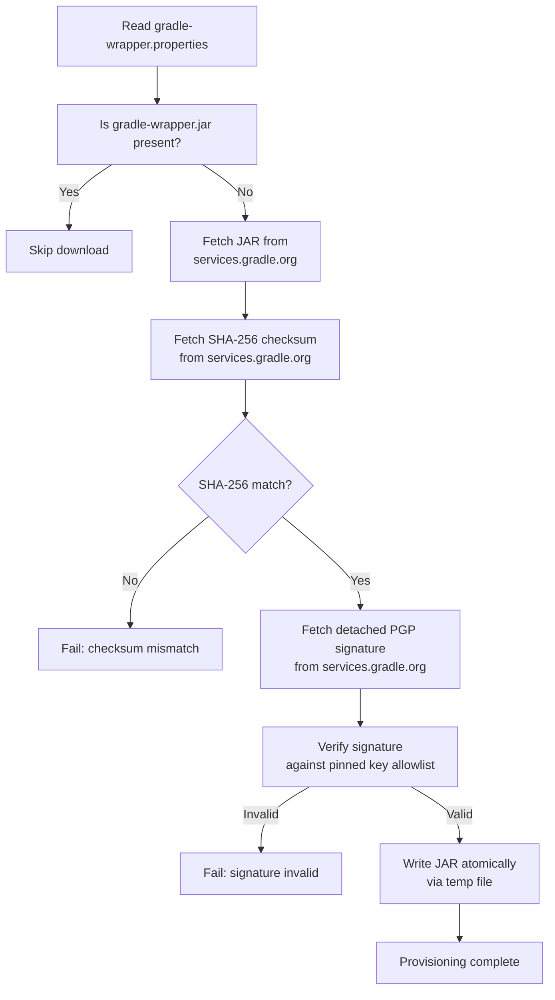

<!--
Copyright 2026 The Buildish Authors

Licensed under the Apache License, Version 2.0 (the "License");
you may not use this file except in compliance with the License.
You may obtain a copy of the License at

http://www.apache.org/licenses/LICENSE-2.0

Unless required by applicable law or agreed to in writing, software
distributed under the License is distributed on an "AS IS" BASIS,
WITHOUT WARRANTIES OR CONDITIONS OF ANY KIND, either express or implied.
See the License for the specific language governing permissions and
limitations under the License.
-->

The action provisions `gradle-wrapper.jar` files before the build runs so that Gradle can be
invoked without the jar being committed to the repository. This is the recommended Gradle project
setup for security-conscious repositories.

## Discovery

The action discovers `gradle-wrapper.properties` files under `base-directory` using:

- If `wrapper-properties-files` is set: the listed explicit file paths (relative to `base-directory`).
- If `process-all-wrapper-files: true`: a glob scan using `wrapper-properties-glob`.
- Otherwise: the single file matched by `wrapper-properties-glob` (default:
  `**/gradle/wrapper/gradle-wrapper.properties`).

An error is raised if more than one file is found when `process-all-wrapper-files` is false and
`wrapper-properties-files` is not set.

## Properties file validation

Each discovered `gradle-wrapper.properties` file is validated before any download attempt:

- The file must exist and be parseable as a Java properties file.
- The `distributionUrl` property must be present.
- The distribution URL must point to a `*.zip` file on `services.gradle.org`.
- The `distributionSha256Sum` property, if present, must be a 64-character lowercase hex string.

Validation is static — no network calls are made during this step.

## Download and verification

### SHA-256 verification

The expected SHA-256 digest is downloaded from `services.gradle.org` (the same host as the JAR)
over HTTPS and compared to the digest of the downloaded JAR bytes. This guards against accidental
file corruption and mirrors the verification that `gradlew` scripts perform locally.

### PGP signature verification

A detached ASCII-armored `.asc` signature is fetched from `services.gradle.org` and verified
against a pinned allowlist of known Gradle signing keys in `src/gradle/wrapper/signature.ts`.

Verification uses GnuPG with a fresh ephemeral home directory so no system keyring is modified.
The GnuPG binary being used is `gpg` on Linux and macOS. For Windows `gpg.exe` is being used;
override with the `BUILDISH_MAMMOTH_CACHE_GRADLE_GPG_COMMAND` environment variable (only evaluated
on Windows) when multiple `gpg` variants exist on the runner, which is common on Windows.

### Atomic write

The JAR is written to a temporary file in the same directory as the target path and then renamed
atomically. This ensures that a partially written JAR is never visible to the Gradle invocation.

### Key allowlist design

The key allowlist in `src/build-tool/gradle/wrapper/signature.ts` is an explicit list of Gradle's published
signing keys. Old and new keys may overlap during a key rotation period. Once a key is no longer
used to sign any wrapper version you support, remove it from the allowlist.

The allowlist is validated at action load time — unrecognized key material in the allowlist causes
a startup error to prevent silently broken signature verification.

## Re-entrant provisioning

If a `gradle-wrapper.jar` already exists at the target path, the action skips download. This means
provisioning is safe to call multiple times (e.g. when multiple wrapper properties files point to
the same Gradle version and download the JAR to the same location).
