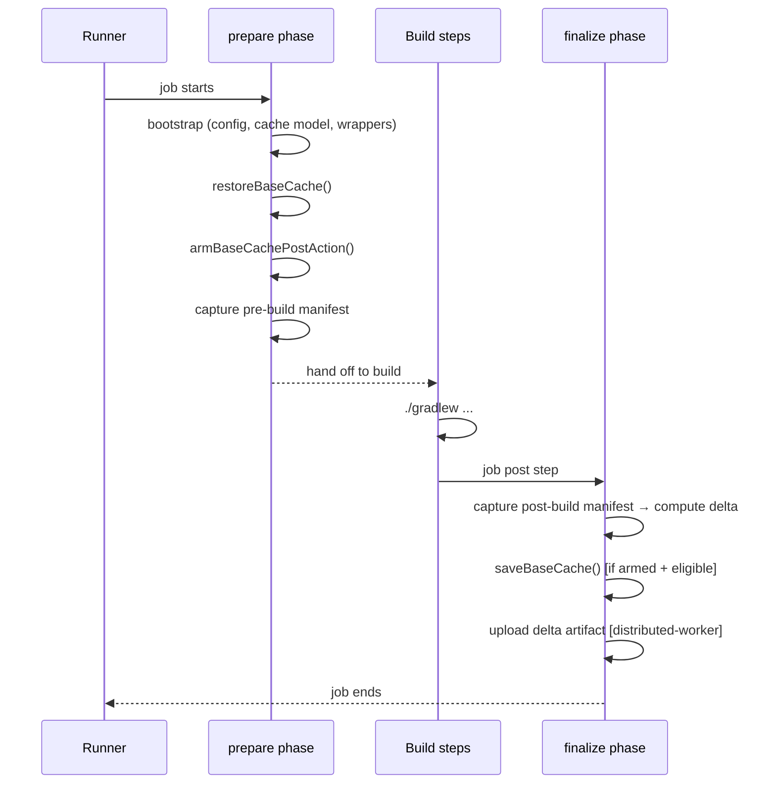
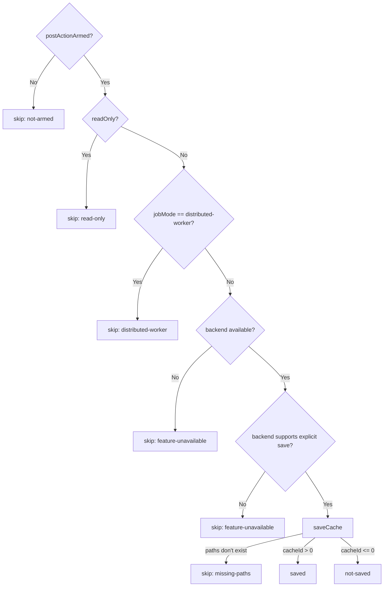
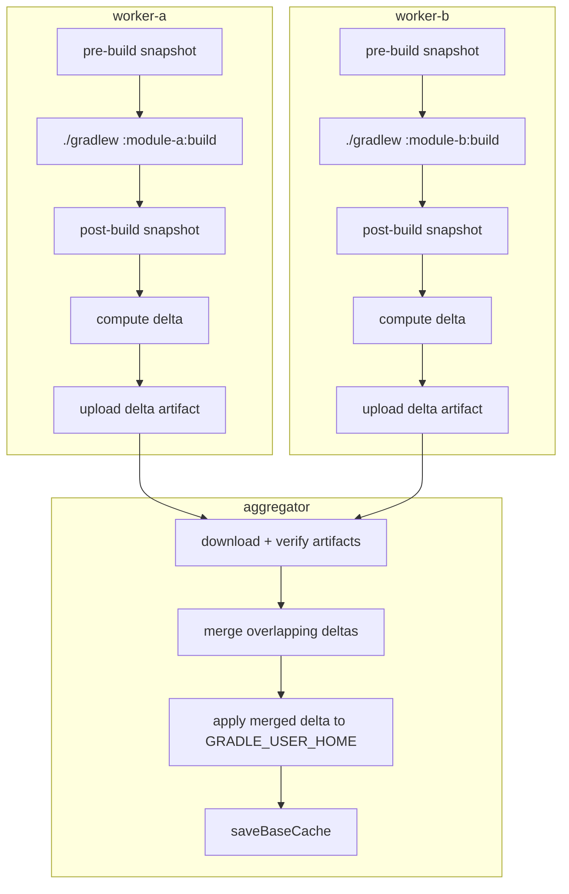

<!--
Copyright 2026 The Apache Software Foundation

Licensed under the Apache License, Version 2.0 (the "License");
you may not use this file except in compliance with the License.
You may obtain a copy of the License at

http://www.apache.org/licenses/LICENSE-2.0

Unless required by applicable law or agreed to in writing, software
distributed under the License is distributed on an "AS IS" BASIS,
WITHOUT WARRANTIES OR CONDITIONS OF ANY KIND, either express or implied.
See the License for the specific language governing permissions and
limitations under the License.
-->

# Base Cache Design

This document describes the base cache restore/save lifecycle, the gating conditions that control
whether a save occurs, the optional `prune-managed` cleanup mode, and the distributed
worker/aggregator delta exchange model.

## Prepare / finalize lifecycle

The action splits its work across two entrypoints that run at different points in the workflow job.

State is passed between the two phases using the CI runtime state store (on GitHub Actions this is
`@actions/core` `saveState` / `getState`). The key state values are:

| State key                                        | Set by                  | Read by    | Purpose                                                   |
| ------------------------------------------------ | ----------------------- | ---------- | --------------------------------------------------------- |
| `buildish-mammoth-cache-gradle-base-cache-armed` | `prepare` after restore | `finalize` | Gate on whether a save should be attempted                |
| pre-build manifest blob                          | `prepare`               | `finalize` | Delta computation between pre- and post-build snapshots   |
| base cache restore result                        | `prepare`               | `finalize` | Lets `finalize` know whether the restore was an exact-hit |
| consumed delta artifact names                    | `prepare`               | `finalize` | Used when cleaning up consumed worker delta artifacts     |

## Base cache restore

`restoreBaseCache()` classifies the restore outcome into one of four statuses:

| Status                | Meaning                                                                        |
| --------------------- | ------------------------------------------------------------------------------ |
| `feature-unavailable` | The cache backend is not available (e.g. not a supported CI environment)       |
| `miss`                | No cache entry matched the primary key or any restore-key prefix               |
| `exact-hit`           | The primary key matched an existing entry exactly                              |
| `partial-hit`         | A restore-key prefix matched a cache entry from a different ref or earlier run |

Both `exact-hit` and `partial-hit` restore cache content to `GRADLE_USER_HOME`. A `partial-hit`
restore does not suppress a later save — it is expected that the build will add or modify files
relative to the older cache snapshot.

## Base cache save gating

`saveBaseCache()` checks a sequence of conditions before writing to the cache:

Distributed worker jobs skip the base cache save intentionally: they only upload a delta artifact
that the aggregator merges. This prevents redundant and conflicting base cache writers.

## Prune-managed cleanup mode (`restore-cleanup-mode: prune-managed`)

This opt-in mode deletes managed files immediately after a base cache restore so the build starts
from a clean slice of the cache:

1. Detect whether the restore was a hit (`exact-hit` or `partial-hit`).
2. If no hit, skip cleanup and proceed normally.
3. If a hit, delete every file currently matched by the active partition include globs within
   `GRADLE_USER_HOME`. Files outside the managed partition space are left untouched.
4. Re-restore the base cache using the same key and paths.
5. If the follow-up restore misses, the action fails rather than starting the build with a
   partially pruned managed cache space.

This mode is narrower than "delete everything outside the include patterns": it only removes files
it would normally manage. It is most useful when you want to guarantee that stale managed files
from previous runs do not accumulate on long-lived runners.

## Distributed delta exchange

In distributed mode each worker job captures a snapshot of `GRADLE_USER_HOME` before and after the
build. The _delta_ (new or modified files) is uploaded as a workflow artifact. The aggregator job
downloads every worker's delta artifact, merges overlapping entries, and applies the merged result
back to `GRADLE_USER_HOME` before saving the updated base cache.

### Delta artifact package structure

Each delta artifact is a zip archive containing:

- `delta-package.json` — metadata: producer job name, run/attempt identity, payload entries with
  relative paths and SHA-256 digests
- `delta-manifest.json` — ordered list of changed entries per partition, using a portable
  `<portable-gradle-user-home>` sentinel in place of the actual `GRADLE_USER_HOME` path
- `payload/<uuid>.bin` — one binary payload file per changed cache file

### Merge conflict resolution

When two workers produce a delta for the same relative path the action attempts to reconcile:

1. **Content-compatible** — same SHA-256, size, and mode: prefer the entry with the newer
   modification timestamp; merge access/modification timestamps from both.
2. **Content-compatible + `allowDuplicateDependentDeltaPaths`** — same rule as above.
3. **Conflicting content** — hard failure unless `allowDuplicateDependentDeltaPaths` is set and
   one entry is strictly newer.

See `src/cache/delta.ts` → `mergeOverlappingDeltaStates()` for the full resolution logic.

### Verification on apply

Before each payload file is written to `GRADLE_USER_HOME` the action:

- Verifies the destination path stays within `GRADLE_USER_HOME` (no traversal).
- Rejects symbolic links at the destination.
- Re-hashes the payload bytes and compares them to the manifest digest.
- Writes the file atomically via a temporary file + rename, the same pattern used for wrapper JARs.
