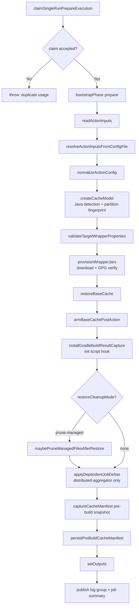
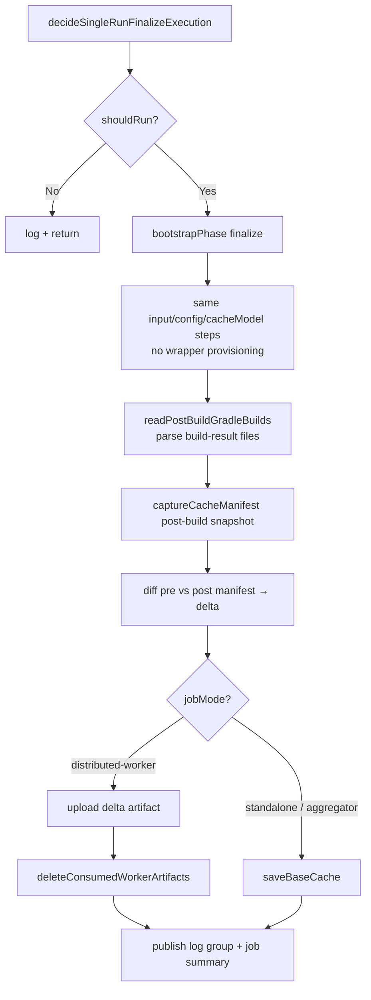

<!--
Copyright 2026 The Apache Software Foundation

Licensed under the Apache License, Version 2.0 (the "License");
you may not use this file except in compliance with the License.
You may obtain a copy of the License at

http://www.apache.org/licenses/LICENSE-2.0

Unless required by applicable law or agreed to in writing, software
distributed under the License is distributed on an "AS IS" BASIS,
WITHOUT WARRANTIES OR CONDITIONS OF ANY KIND, either express or implied.
See the License for the specific language governing permissions and
limitations under the License.
-->

# Bootstrap Process

This document describes the full execution sequence for both the `prepare` and `finalize` phases,
covering input resolution, config normalization, cache model creation, wrapper provisioning,
single-run guarding, and the state that flows between phases.

## Two-phase execution model

The action runs twice per job: once before the build (`prepare`) and once after (`finalize`). On
GitHub Actions these map to `main` and `post` steps respectively. The boundary is intentional —
it lets the action snapshot `GRADLE_USER_HOME` before and after the build to compute a precise
delta without modifying anything while the build is running.

## Prepare phase (`src/entrypoints/cli/prepare.ts` → `executeMainAction`)

### Single-run guard

`claimSingleRunPrepareExecution()` writes a JSON guard file to the runner temp directory using
`O_EXCL` atomic-create semantics. A UUID owner token is stored in the CI runtime state so the
finalize phase can confirm it is the matching invocation.

If a second action step tries to claim the same guard file (identical job identity hash) the claim
is rejected immediately and both the prepare and finalize executions of the duplicate are skipped.
This prevents corrupted state from two concurrent action invocations in the same job.

### Input resolution

1. **Direct inputs** are read from the CI runtime host (`getInput`).
2. **Config file** — if `config-file` is set, the file is loaded and parsed; direct inputs
   override any values in the file. `github-token` is rejected in config files.
3. **Normalisation** — `normalizeActionConfig()` applies defaults, resolves `read-only` from the
   event type (`pull_request` → `true`), and validates all inputs.

### Cache model creation (`src/cache/model.ts`)

1. `java -version` is run to detect the Java major version (overridable via `JAVA_BIN`).
2. The active partition list is resolved by applying user overrides to the built-in presets.
3. A 16-character SHA-256 partition fingerprint is computed from the full ordered partition layout.
4. The cache key is rendered from the template (see [`docs/cache-key-generation.md`](cache-key-generation.md)).

### Wrapper provisioning

Wrapper provisioning is performed only during `prepare`. For each discovered
`gradle-wrapper.properties` file the action runs the full download and verification chain. See
[`docs/wrapper-provisioning.md`](wrapper-provisioning.md) for the complete flow.

### Base cache restore

`restoreBaseCache()` attempts to restore `GRADLE_USER_HOME` from the cache backend. After the
restore, `armBaseCachePostAction()` writes `true` to the CI state store so the finalize phase
knows a legitimate prepare phase ran.

### Build-result capture hook

`installGradleBuildResultCapture()` writes the Gradle init script and service plugin to
`$GRADLE_USER_HOME/.buildish-mammoth-cache-gradle/`. These files are picked up automatically by
every subsequent Gradle invocation in the job. See
[`docs/wrapper-provisioning.md`](wrapper-provisioning.md#relationship-to-the-buildish-build-result-capture-tool)
for details.

### Pre-build manifest

`captureCacheManifest()` snapshots the current state of `GRADLE_USER_HOME` (file paths, sizes,
modification times, SHA-256 digests). The manifest is serialised and stored in the CI state store
so the finalize phase can compute a precise delta.

## Finalize phase (`src/entrypoints/cli/finalize.ts` → `executePostAction`)

### Single-run finalize guard

`decideSingleRunFinalizeExecution()` reads the owner token from the CI state store. If the token
is empty or the prepare was rejected as a duplicate, the finalize step exits immediately without
performing any cache or artifact operations.

### Post-build manifest and delta computation

`captureCacheManifest()` is called again with the current (post-build) state of
`GRADLE_USER_HOME`. The finalize phase diffs the pre- and post-build manifests to produce a list
of added, modified, and deleted files.

### Delta artifact upload (distributed-worker)

In `distributed-worker` mode the delta is packaged as a zip archive and uploaded as a workflow
artifact. The artifact name encodes the producer job name and run/attempt identity so the
aggregator can locate it reliably.

### Base cache save (standalone / distributed-aggregator)

`saveBaseCache()` is called with the gating logic described in
[`docs/base-cache-design.md`](base-cache-design.md#base-cache-save-gating). The aggregator first
applies all worker deltas via `applyMergedDeltaPlan()` and then saves the combined result.

## State flow summary

| State key | Set during | Read during | Purpose |
|---|---|---|---|
| single-run owner token | prepare | finalize | Verify finalize belongs to this invocation |
| single-run duplicate flag | prepare | finalize | Skip finalize if prepare was rejected |
| base-cache-armed | prepare (after restore) | finalize | Gate the explicit cache save |
| pre-build manifest blob | prepare | finalize | Delta computation input |
| base cache restore result | prepare | finalize | Metadata for the finalize log summary |
| consumed delta artifact names | prepare (aggregator) | finalize (aggregator) | Artifact cleanup |
| delta artifact execution identity | prepare | finalize | Cross-phase identity for artifact lookup |

