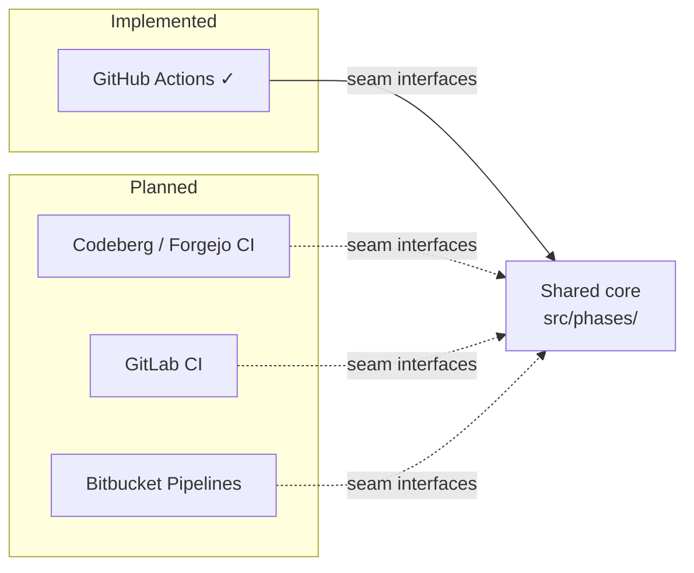

<!--
Copyright 2026 The Apache Software Foundation

Licensed under the Apache License, Version 2.0 (the "License");
you may not use this file except in compliance with the License.
You may obtain a copy of the License at

http://www.apache.org/licenses/LICENSE-2.0

Unless required by applicable law or agreed to in writing, software
distributed under the License is distributed on an "AS IS" BASIS,
WITHOUT WARRANTIES OR CONDITIONS OF ANY KIND, either express or implied.
See the License for the specific language governing permissions and
limitations under the License.
-->

## Provider status

| Provider            | Cache backend             | Artifact backend         | Host adapters | Entrypoints | Status      |
| ------------------- | ------------------------- | ------------------------ | ------------- | ----------- | ----------- |
| GitHub Actions      | ✓                         | ✓                        | ✓             | ✓           | Implemented |
| Codeberg / Forgejo  | —                         | —                        | —             | —           | Planned     |
| GitLab CI           | —                         | —                        | —             | —           | Planned     |
| Bitbucket Pipelines | ⚠ no native frontend      | —                        | —             | —           | Planned     |
| Jenkins             | ⚠ external store required | ✓ (Copy Artifact Plugin) | —             | —           | Assessed    |

## Architecture

The action is designed to run on multiple CI platforms without changes to the shared core.
The seam between platform-specific and platform-agnostic code is defined by a set of TypeScript
interfaces. See [CI Abstraction Layer](../../architecture/ci-abstraction/) for the full interface
list and provider boundary rules.

### Directory structure

| Path                      | Role                                                                                |
| ------------------------- | ----------------------------------------------------------------------------------- |
| `src/ci/<provider>/`      | Platform-specific adapters implementing the seam interfaces                         |
| `src/phases/`             | Shared prepare/finalize logic; never imports from `src/ci/`                         |
| `src/cache/backend.ts`    | `BaseCacheBackend` interface                                                        |
| `src/delta/backend.ts`    | `WorkflowArtifactBackend` interface                                                 |
| `src/host/types.ts`       | `HostReporter`, `HostStateStore`, `HostInputSource`, `HostOutputSink`, `ReportSink` |
| `src/ci/types.ts`         | `CiPlatformAdapter`, `CiJobContext`                                                 |
| `descriptors/<provider>/` | CI descriptor files (action.yml, .gitlab-ci.yml, etc.)                              |

### What each provider adapter must implement

1. **`BaseCacheBackend`** (`src/cache/backend.ts`) — save and restore the base cache using the
   provider's native cache service.
2. **`WorkflowArtifactBackend`** (`src/delta/backend.ts`) — upload, list, and download delta
   artifact packages using the provider's artifact service.
3. **`HostReporter`** — write log output and group markers to the CI log.
4. **`HostStateStore`** — persist and retrieve cross-phase state between prepare and finalize.
5. **`HostInputSource`** — read action/pipeline configuration inputs from the CI environment.
6. **`HostOutputSink`** — write outputs back to the CI environment.
7. **`ReportSink`** — write job summaries or equivalent reports.
8. **`CiPlatformAdapter`** — expose `CiJobContext` (job name, run ID, run attempt, URLs).

### Phases that do NOT exist on some platforms

GitHub Actions has distinct `main` and `post` execution phases, which map to the `prepare` and
`finalize` concepts in this project. Codeberg/Forgejo CI also supports a post-execution hook.
GitLab CI does not have a built-in equivalent, so the finalize logic would need to be invoked
explicitly as a separate pipeline job or an `after_script` step. Bitbucket Pipelines has
`after-script`, which runs in the same container as the main `script` and maps cleanly onto the
finalize phase.

The prepare/finalize naming in this codebase is intentionally CI-agnostic to support all of these
patterns.

## Per-provider notes

- [Codeberg / Forgejo CI](./codeberg/)
- [GitLab CI](./gitlab/)
- [Bitbucket Pipelines](./bitbucket/)
- [Jenkins](./jenkins/)
