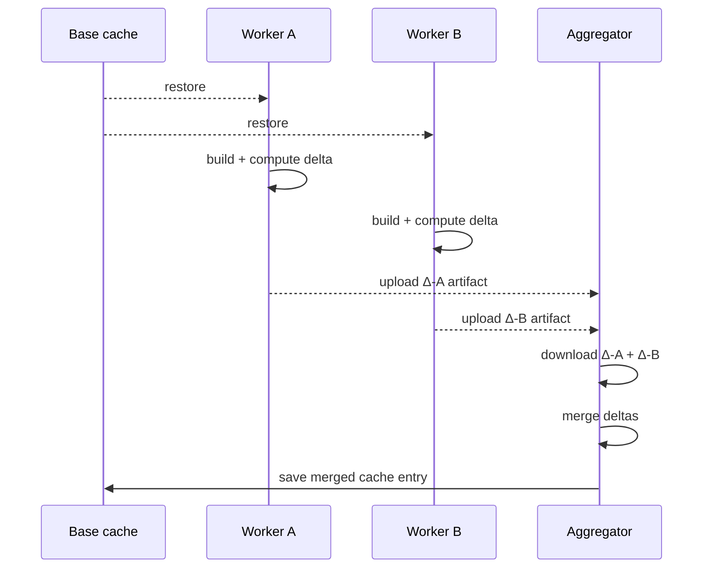

<!--
Copyright 2026 The Apache Software Foundation

Licensed under the Apache License, Version 2.0 (the "License");
you may not use this file except in compliance with the License.
You may obtain a copy of the License at

http://www.apache.org/licenses/LICENSE-2.0

Unless required by applicable law or agreed to in writing, software
distributed under the License is distributed on an "AS IS" BASIS,
WITHOUT WARRANTIES OR CONDITIONS OF ANY KIND, either express or implied.
See the License for the specific language governing permissions and
limitations under the License.
-->

## Why distributed mode exists

When multiple Gradle jobs run in parallel and each one tries to save the cache at the end, only the
last writer survives. The other jobs' dependency downloads, compiled scripts, and build cache
entries are overwritten and lost on the next run.

Distributed mode solves this with **delta exchange**:

- Each **worker job** uploads only the files that _changed_ in `GRADLE_USER_HOME` during its build
  as a workflow artifact (the delta). It does not write the base cache directly.
- A **aggregator job**, which waits for all workers to complete, downloads every delta, merges
  them, and saves the merged result as the new base cache entry.

Every parallel job's changes are captured. On the next run, all workers start from a cache that
reflects the combined output of every job from the previous run.



## How delta exchange works

1. The worker's **prepare** step restores the base cache and captures a snapshot of
   `GRADLE_USER_HOME` (the pre-build manifest).
2. The build runs normally.
3. The worker's **finalize** step captures a second snapshot (the post-build manifest), computes
   the difference, packs only the changed and added files into a compressed artifact, and uploads
   it. The base cache is not written.
4. The aggregator's **prepare** step restores the base cache.
5. The aggregator's **finalize** step downloads every worker delta in `dependent-jobs` order,
   merges them (later jobs win on conflicts), applies the result to `GRADLE_USER_HOME`, and saves
   the new base cache entry.

## Workflow example

```yaml
jobs:
  worker-a:
    runs-on: ubuntu-latest
    permissions:
      actions: write
      contents: read
    steps:
      - uses: actions/checkout@93cb6efe18208431cddfb8368fd83d5badbf9bfd
      - uses: actions/setup-java@be666c2fcd27ec809703dec50e508c2fdc7f6654
        with:
          distribution: temurin
          java-version: '21'
      - uses: apache/buildish-mammoth-cache-gradle/descriptors/github/internal-unreleased-consumer-path@<commit-sha>
        with:
          job-mode: distributed-worker
      - run: ./gradlew :module-a:build

  worker-b:
    runs-on: ubuntu-latest
    permissions:
      actions: write
      contents: read
    steps:
      - uses: actions/checkout@93cb6efe18208431cddfb8368fd83d5badbf9bfd
      - uses: actions/setup-java@be666c2fcd27ec809703dec50e508c2fdc7f6654
        with:
          distribution: temurin
          java-version: '21'
      - uses: apache/buildish-mammoth-cache-gradle/descriptors/github/internal-unreleased-consumer-path@<commit-sha>
        with:
          job-mode: distributed-worker
      - run: ./gradlew :module-b:build

  aggregator:
    needs: [worker-a, worker-b]
    runs-on: ubuntu-latest
    permissions:
      actions: write
      contents: read
    steps:
      - uses: actions/checkout@93cb6efe18208431cddfb8368fd83d5badbf9bfd
      - uses: actions/setup-java@be666c2fcd27ec809703dec50e508c2fdc7f6654
        with:
          distribution: temurin
          java-version: '21'
      - uses: apache/buildish-mammoth-cache-gradle/descriptors/github/internal-unreleased-consumer-path@<commit-sha>
        with:
          job-mode: distributed-aggregator
          dependent-jobs: worker-a, worker-b
```

## Requirements and constraints

**Job names must be unique within the workflow run.** Delta artifacts are identified by job name.
Two worker jobs with the same name would produce the same artifact name and the aggregator would
only see one of them.

**The aggregator must declare `needs` for every worker.** This ensures all deltas are uploaded
before the aggregator starts its finalize step.

**Workers do not need the aggregator in their `needs`.** Workers are independent of each other;
only the aggregator depends on all workers.

**Re-runs work correctly.** A delta artifact is identified by job name, run ID, _and_ run attempt
number. If a worker is re-run, its new artifact supersedes the old one and the aggregator picks
up the fresh artifact automatically.

## Using a config file

Repeat inputs can be moved to a shared config file:

```yaml
# .github/buildish-mammoth-gradle.yml
cache-key-prefix: my-project-gradle-
wrapper-properties-files: gradle/wrapper/gradle-wrapper.properties
```

```yaml
# Each worker job
- uses: apache/buildish-mammoth-cache-gradle/descriptors/github/internal-unreleased-consumer-path@<commit-sha>
  with:
    job-mode: distributed-worker
    config-file: .github/buildish-mammoth-gradle.yml

# Aggregator job
- uses: apache/buildish-mammoth-cache-gradle/descriptors/github/internal-unreleased-consumer-path@<commit-sha>
  with:
    job-mode: distributed-aggregator
    dependent-jobs: worker-a, worker-b
    config-file: .github/buildish-mammoth-gradle.yml
```
