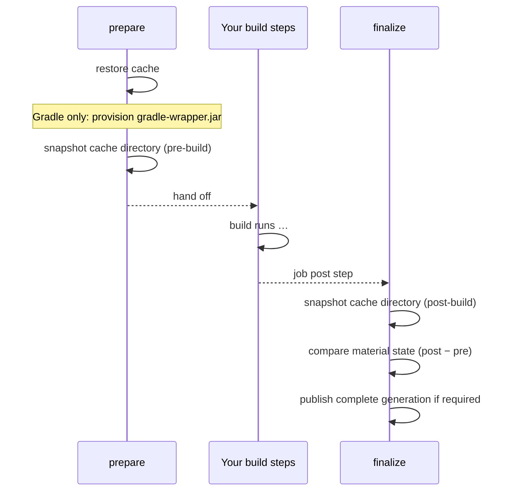

<!--
Copyright 2026 The Buildish Authors

Licensed under the Apache License, Version 2.0 (the "License");
you may not use this file except in compliance with the License.
You may obtain a copy of the License at

http://www.apache.org/licenses/LICENSE-2.0

Unless required by applicable law or agreed to in writing, software
distributed under the License is distributed on an "AS IS" BASIS,
WITHOUT WARRANTIES OR CONDITIONS OF ANY KIND, either express or implied.
See the License for the specific language governing permissions and
limitations under the License.
-->

## What this action does

This action speeds up JVM builds on CI by caching the build tool's local artifact store between
runs. On each run it:

1. **Restores** the cache before the build so the build tool finds its dependencies already in
   place.
2. **Publishes** a new complete immutable cache generation after a material change. Unchanged hits
   do not create duplicate entries.

Two job modes are available for both build tools:

- **[Single-job](../single-job/)** — one build job per workflow run. The action wraps that job and
  handles everything automatically.
- **[Distributed multi-job](../distributed-jobs/)** — multiple parallel build jobs. Each job
  uploads only the delta it produced; a dedicated aggregator job merges all deltas into the next
  cache entry so no job's work is lost.

### Gradle

For Gradle the action caches `GRADLE_USER_HOME` and additionally:

- **Provisions** any missing `gradle-wrapper.jar` files, verifying each one with a SHA-256
  checksum and a PGP signature before writing it to disk. See
  [Security](../security/#gradle-wrapper-verification) for details.

### Maven

For Maven the action caches the local repository (`~/.m2` by default, or the path set by
`maven-local-repository`). No wrapper provisioning is performed — Maven's own bootstrap is
handled by the runner environment or `actions/setup-java`.

## Quick start

Add the action as a step _before_ your build invocation. Until the first public release, pin a
commit SHA:

> [!WARNING]
> Do not set `cache: gradle` or `cache: maven` on `actions/setup-java` when using this action.
> Both would restore and save the same directory through independent cache lifecycles. The competing
> snapshots waste storage and can undo the managed state assembled by distributed jobs. Use
> `actions/setup-java` for JDK installation only, as the examples above show.

`actions: write` is required so the action can save cache entries and exchange delta artifacts.
See [Security](../security/) for the full permissions breakdown.

The action defaults to **read-only** on `pull_request` and `pull_request_target` events, so
cache writes from untrusted forks are automatically suppressed. Repository config can make this
policy stricter but cannot lower the pull-request floor; only a direct workflow input can do that.
Distributed read-only workers upload nothing, and read-only aggregators perform no artifact
exchange.

### Gradle

```yaml
jobs:
  build:
    runs-on: ubuntu-latest
    permissions:
      actions: write
      contents: read
    steps:
      - uses: actions/checkout@93cb6efe18208431cddfb8368fd83d5badbf9bfd
      - uses: actions/setup-java@be666c2fcd27ec809703dec50e508c2fdc7f6654
        with:
          distribution: temurin
          java-version: '21'
      - uses: buildish-tooling/buildish-mammoth-cache/actions/github/gradle@<commit-sha>
      - run: ./gradlew build
```

### Maven

```yaml
jobs:
  build:
    runs-on: ubuntu-latest
    permissions:
      actions: write
      contents: read
    steps:
      - uses: actions/checkout@93cb6efe18208431cddfb8368fd83d5badbf9bfd
      - uses: actions/setup-java@be666c2fcd27ec809703dec50e508c2fdc7f6654
        with:
          distribution: temurin
          java-version: '21'
      - uses: buildish-tooling/buildish-mammoth-cache/actions/github/maven@<commit-sha>
      - run: mvn verify
```

## How it works

The action runs twice per job: a **prepare** step before the build and a **finalize** step after.
This two-phase structure is what makes precise, non-invasive caching possible — the action
snapshots the build tool's cache directory before the build, snapshots it again after, and saves
only the difference without interfering while the build runs.



For distributed multi-job builds, worker jobs upload their delta as a workflow artifact instead of
saving the cache directly. An aggregator job then merges all worker deltas into a single cache
entry. See [Distributed multi-job](../distributed-jobs/) for details.
