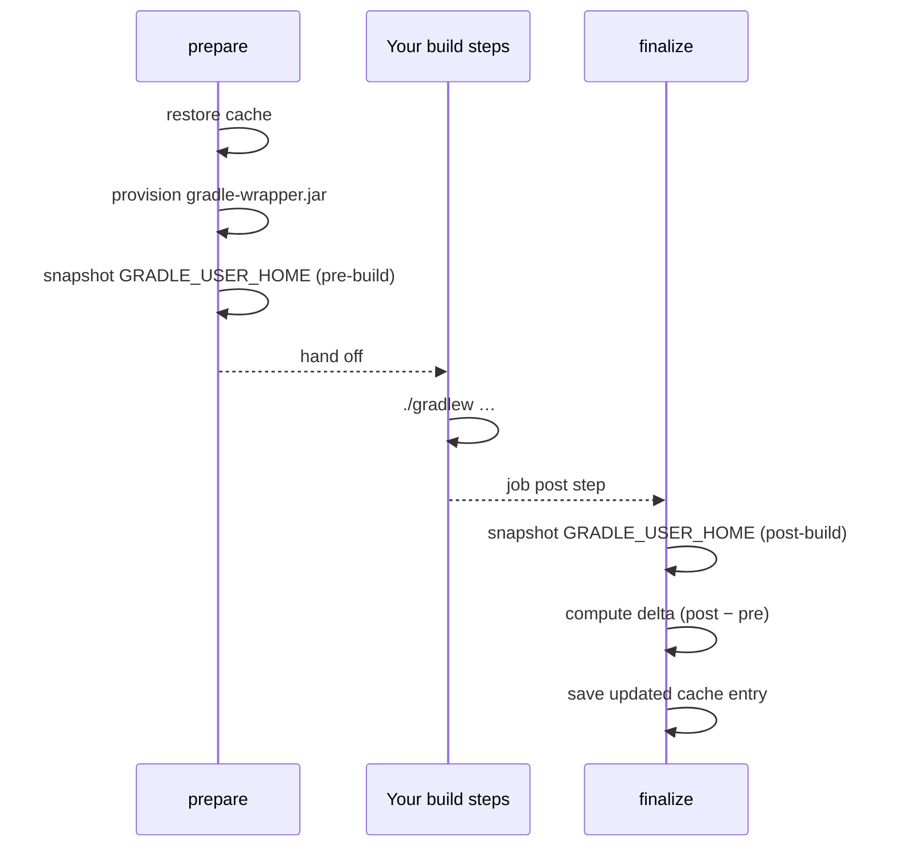

<!--
Copyright 2026 The Apache Software Foundation

Licensed under the Apache License, Version 2.0 (the "License");
you may not use this file except in compliance with the License.
You may obtain a copy of the License at

http://www.apache.org/licenses/LICENSE-2.0

Unless required by applicable law or agreed to in writing, software
distributed under the License is distributed on an "AS IS" BASIS,
WITHOUT WARRANTIES OR CONDITIONS OF ANY KIND, either express or implied.
See the License for the specific language governing permissions and
limitations under the License.
-->

## What this action does

This action speeds up Gradle builds on CI by caching the Gradle user home (`GRADLE_USER_HOME`)
between runs. On each run it:

1. **Restores** the cache before the build so Gradle finds its dependencies, compiled scripts, and
   build-cache entries already in place.
2. **Provisions** any missing `gradle-wrapper.jar` files, verifying each one with a SHA-256
   checksum and a PGP signature before writing it to disk.
3. **Saves** an updated cache entry after the build with only the files that changed.

Two job modes are available:

- **[Single-job](../single-job/)** — one Gradle job per workflow run. The action wraps that job and
  handles everything automatically.
- **[Distributed multi-job](../distributed-jobs/)** — multiple parallel Gradle jobs. Each job
  uploads only the delta it produced; a dedicated aggregator job merges all deltas into the next
  cache entry so no job's work is lost.

## Quick start

Add the action as a step _before_ your Gradle invocation. Until the first public release, pin a
commit SHA:

```yaml
jobs:
  build:
    runs-on: ubuntu-latest
    permissions:
      actions: write
      contents: read
    steps:
      - uses: actions/checkout@93cb6efe18208431cddfb8368fd83d5badbf9bfd
      - uses: actions/setup-java@be666c2fcd27ec809703dec50e508c2fdc7f6654
        with:
          distribution: temurin
          java-version: '21'
      - uses: apache/buildish-mammoth-cache-gradle/descriptors/github/internal-unreleased-consumer-path@<commit-sha>
      - run: ./gradlew build
```

`actions: write` is required so the action can save cache entries and exchange delta artifacts.
See [Security & Maintenance](../security/) for the full permissions breakdown.

The action defaults to **read-only** on `pull_request` and `pull_request_target` events, so
cache writes from untrusted forks are automatically suppressed.

## How it works

The action runs twice per job: a **prepare** step before the build and a **finalize** step after.
This two-phase structure is what makes precise, non-invasive caching possible — the action takes
a snapshot of `GRADLE_USER_HOME` before the build, another snapshot after, and saves only the
difference without interfering while the build runs.



For distributed multi-job builds, worker jobs upload their delta as a workflow artifact instead of
saving the cache directly. An aggregator job then merges all worker deltas into a single cache
entry. See [Distributed multi-job](../distributed-jobs/) for details.
