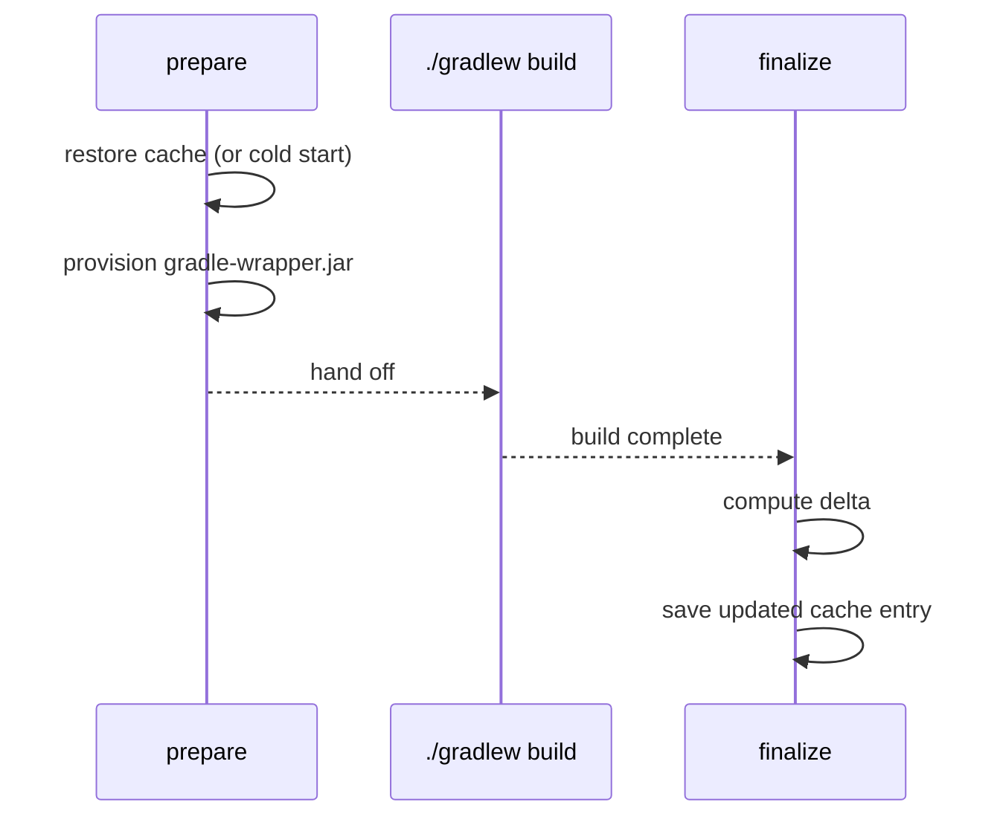
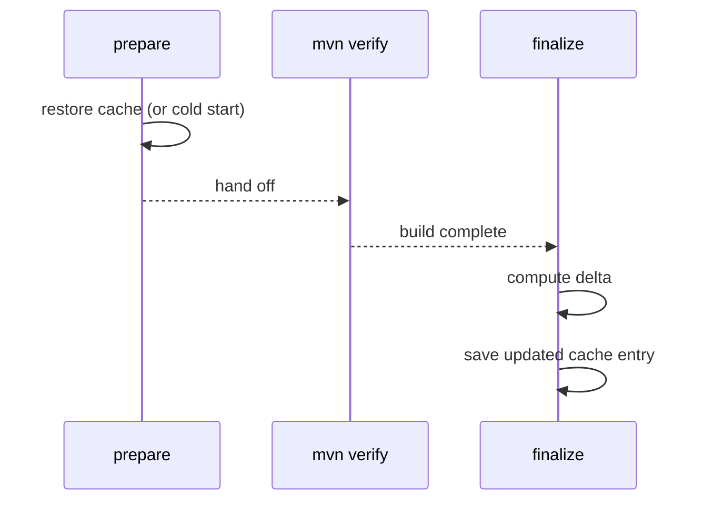

<!--
Copyright 2026 The Buildish Authors

Licensed under the Apache License, Version 2.0 (the "License");
you may not use this file except in compliance with the License.
You may obtain a copy of the License at

http://www.apache.org/licenses/LICENSE-2.0

Unless required by applicable law or agreed to in writing, software
distributed under the License is distributed on an "AS IS" BASIS,
WITHOUT WARRANTIES OR CONDITIONS OF ANY KIND, either express or implied.
See the License for the specific language governing permissions and
limitations under the License.
-->

Single-job mode (`job-mode: standalone`, which is the default) is the right choice when your
workflow runs one build job at a time. The action restores the cache before the build and saves an
updated cache entry after — only the changed files are written back, keeping entries lean.

## Gradle

For Gradle, the prepare step additionally provisions any missing wrapper JARs before handing off
to your build.



### Minimal workflow

```yaml
jobs:
  build:
    runs-on: ubuntu-latest
    permissions:
      actions: write
      contents: read
    steps:
      - uses: actions/checkout@93cb6efe18208431cddfb8368fd83d5badbf9bfd
      - uses: actions/setup-java@be666c2fcd27ec809703dec50e508c2fdc7f6654
        with:
          distribution: temurin
          java-version: '21'
      - uses: buildish-tooling/buildish-mammoth-cache/actions/github/gradle@<commit-sha>
      - run: ./gradlew build
```

### Config file

```yaml
# .github/buildish-mammoth-gradle.yml
cache-key-prefix: my-project-gradle-
wrapper-properties-files: gradle/wrapper/gradle-wrapper.properties
```

```yaml
steps:
  - uses: actions/checkout@93cb6efe18208431cddfb8368fd83d5badbf9bfd
  - uses: buildish-tooling/buildish-mammoth-cache/actions/github/gradle@<commit-sha>
    with:
      config-file: .github/buildish-mammoth-gradle.yml
  - run: ./gradlew build
```

## Maven

For Maven the prepare step restores the local repository and the finalize step saves back the
delta. No wrapper provisioning is performed.



### Minimal workflow

```yaml
jobs:
  build:
    runs-on: ubuntu-latest
    permissions:
      actions: write
      contents: read
    steps:
      - uses: actions/checkout@93cb6efe18208431cddfb8368fd83d5badbf9bfd
      - uses: actions/setup-java@be666c2fcd27ec809703dec50e508c2fdc7f6654
        with:
          distribution: temurin
          java-version: '21'
      - uses: buildish-tooling/buildish-mammoth-cache/actions/github/maven@<commit-sha>
      - run: mvn verify
```

### Config file

```yaml
# .github/buildish-mammoth-maven.yml
cache-key-prefix: my-project-maven-
```

```yaml
steps:
  - uses: actions/checkout@93cb6efe18208431cddfb8368fd83d5badbf9bfd
  - uses: buildish-tooling/buildish-mammoth-cache/actions/github/maven@<commit-sha>
    with:
      config-file: .github/buildish-mammoth-maven.yml
  - run: mvn verify
```

## Pull-request read-only mode

Both actions automatically switch to read-only on `pull_request` and `pull_request_target`
events — no configuration needed. In read-only mode the cache is restored as normal but the
finalize step skips the save, preventing untrusted fork code from poisoning the cache.

You can also force read-only mode explicitly with `read-only: true` for any event, or opt out
with `read-only: false` when you have controlled-fork trust setups.

## Next steps

- [Configuration Reference](../configuration/) — all inputs and config-file options
- [Cache Partitions](../cache-partitions/) — customize which parts of the build tool cache are saved
- [Distributed multi-job builds](../distributed-jobs/) — if you run multiple build jobs in parallel
