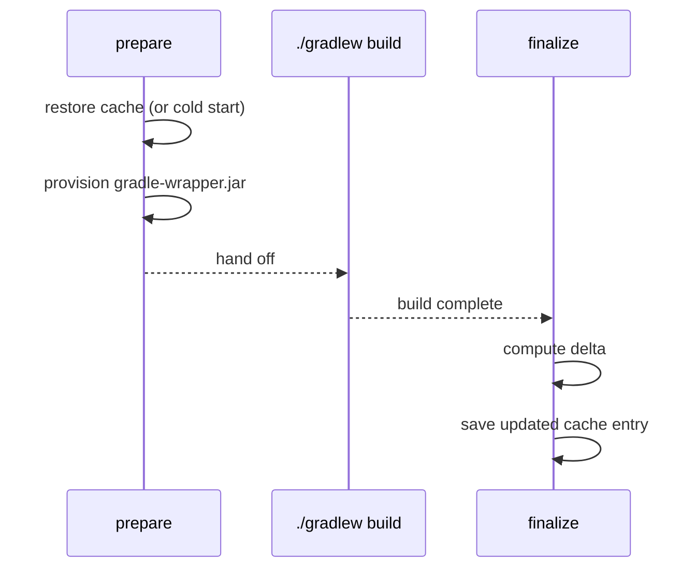

<!--
Copyright 2026 The Apache Software Foundation

Licensed under the Apache License, Version 2.0 (the "License");
you may not use this file except in compliance with the License.
You may obtain a copy of the License at

http://www.apache.org/licenses/LICENSE-2.0

Unless required by applicable law or agreed to in writing, software
distributed under the License is distributed on an "AS IS" BASIS,
WITHOUT WARRANTIES OR CONDITIONS OF ANY KIND, either express or implied.
See the License for the specific language governing permissions and
limitations under the License.
-->

Single-job mode (`job-mode: standalone`, which is the default) is the right choice when your
workflow runs one Gradle job at a time. The action restores the cache before the build, provisions
any missing wrapper JARs, and saves an updated cache entry after the build.



## Minimal workflow

```yaml
jobs:
  build:
    runs-on: ubuntu-latest
    permissions:
      actions: write
      contents: read
    steps:
      - uses: actions/checkout@93cb6efe18208431cddfb8368fd83d5badbf9bfd
      - uses: actions/setup-java@be666c2fcd27ec809703dec50e508c2fdc7f6654
        with:
          distribution: temurin
          java-version: '21'
      - uses: apache/buildish-mammoth-cache-gradle/descriptors/github/internal-unreleased-consumer-path@<commit-sha>
      - run: ./gradlew build
```

## Pull-request read-only mode

The action automatically switches to read-only on `pull_request` and `pull_request_target`
events — no configuration needed. In read-only mode the cache is restored as normal but the
finalize step skips the save, preventing untrusted fork code from poisoning the cache.

```yaml
on:
  push:
    branches: [main]
  pull_request:

jobs:
  build:
    runs-on: ubuntu-latest
    permissions:
      actions: write
      contents: read
    steps:
      - uses: actions/checkout@93cb6efe18208431cddfb8368fd83d5badbf9bfd
      - uses: actions/setup-java@be666c2fcd27ec809703dec50e508c2fdc7f6654
        with:
          distribution: temurin
          java-version: '21'
      - uses: apache/buildish-mammoth-cache-gradle/descriptors/github/internal-unreleased-consumer-path@<commit-sha>
      - run: ./gradlew build
```

You can also force read-only mode explicitly with `read-only: true` for any event.

## Centralized configuration with a config file

Use a config file to keep action inputs in one place and share them across jobs without repetition:

```yaml
# .github/buildish-mammoth-gradle.yml
cache-key-prefix: my-project-gradle-
wrapper-properties-files: gradle/wrapper/gradle-wrapper.properties
```

```yaml
steps:
  - uses: actions/checkout@93cb6efe18208431cddfb8368fd83d5badbf9bfd
  - uses: apache/buildish-mammoth-cache-gradle/descriptors/github/internal-unreleased-consumer-path@<commit-sha>
    with:
      config-file: .github/buildish-mammoth-gradle.yml
  - run: ./gradlew build
```

Direct action inputs override config-file values. See [Configuration Reference](./configuration/)
for all available options.

## Next steps

- [Configuration Reference](./configuration/) — all inputs and config-file options
- [Cache Partitions](./cache-partitions/) — customize which parts of `GRADLE_USER_HOME` are cached
- [Distributed multi-job builds](./distributed-jobs/) — if you run multiple Gradle jobs in parallel
