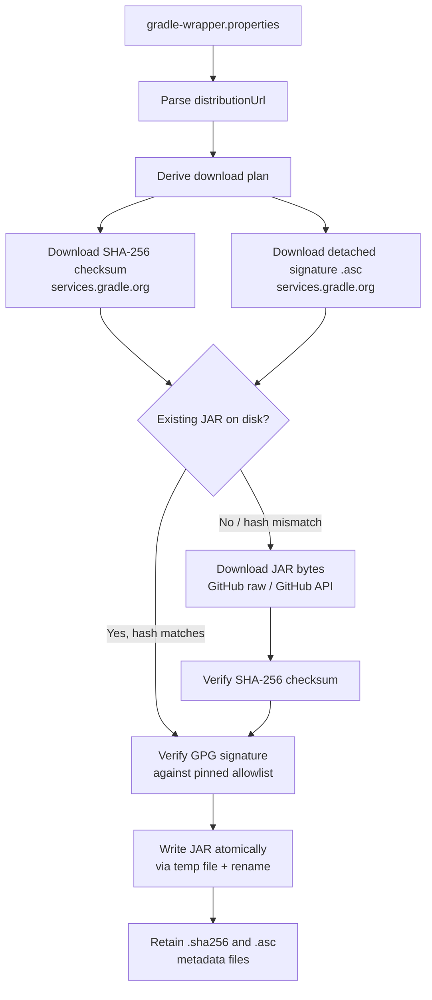

<!--
Copyright 2026 The Apache Software Foundation

Licensed under the Apache License, Version 2.0 (the "License");
you may not use this file except in compliance with the License.
You may obtain a copy of the License at

http://www.apache.org/licenses/LICENSE-2.0

Unless required by applicable law or agreed to in writing, software
distributed under the License is distributed on an "AS IS" BASIS,
WITHOUT WARRANTIES OR CONDITIONS OF ANY KIND, either express or implied.
See the License for the specific language governing permissions and
limitations under the License.
-->

# Gradle Wrapper Provisioning

This document explains how Apache Buildish Mammoth Cache for Gradle discovers, validates, downloads,
and verifies `gradle-wrapper.jar` files, and describes the companion build-result capture tool that
the action installs alongside it.

## Why wrapper provisioning matters

The `gradle-wrapper.jar` bootstraps every Gradle invocation. A tampered or corrupted JAR can
silently alter build behaviour or introduce malicious code before your build scripts ever run.
This action enforces a strict multi-step verification chain so you never execute an unverified JAR.

## Wrapper discovery

During the `prepare` phase the action locates `gradle-wrapper.properties` files using one of three
mutually-exclusive modes:

| Mode                    | Input                             | Behaviour                                                                                                             |
| ----------------------- | --------------------------------- | --------------------------------------------------------------------------------------------------------------------- |
| Auto-discover (default) | `wrapper-properties-glob`         | Scans `base-directory` for all files matching the glob; default glob is `**/gradle/wrapper/gradle-wrapper.properties` |
| Process-all             | `process-all-wrapper-files: true` | Equivalent to auto-discover with the default glob but made explicit for multi-project repositories                    |
| Explicit list           | `wrapper-properties-files`        | Comma- or newline-separated list of paths relative to `base-directory`; no globbing                                   |

## Static validation

Each discovered `gradle-wrapper.properties` file is validated before any network request is made:

- `distributionUrl` must be an HTTPS URL pointing to `services.gradle.org`.
- The URL must not contain credentials, query parameters, or fragments.
- The distribution path must match the pattern
  `gradle-<major.minor[.patch]>-<type>.zip` (e.g. `gradle-8.14-bin.zip`).
- Symbolic links are rejected.

Only files that pass static validation proceed to the download stage.

## Download and verification flow



### Step 1 — derive the download plan (`src/wrapper/download.ts`)

From the validated `distributionUrl` the action derives:

- **`distributionVersion`** — extracted from the path, e.g. `8.14`
- **`wrapperSourceVersion`** — two-segment versions are normalised to three segments (`8.14` → `8.14.0`)
- **`wrapperChecksumUrl`** — `https://services.gradle.org/distributions/gradle-<ver>-wrapper.jar.sha256`
- **`wrapperSignatureUrl`** — `https://services.gradle.org/distributions/gradle-<ver>-wrapper.jar.asc`
- **`wrapperJarUrl`** — `https://raw.githubusercontent.com/gradle/gradle/v<ver>/gradle/wrapper/gradle-wrapper.jar`

### Step 2 — fetch checksum and signature in parallel

Both resources are fetched from `services.gradle.org` with exponential-backoff retry (default 3
attempts, 1 s base delay). HTTP 404 responses are not retried. The `Retry-After` header is
honoured up to a 5-minute ceiling.

### Step 3 — reuse or download the JAR

If a `gradle-wrapper.jar` already exists next to the properties file and its SHA-256 matches the
expected checksum, the existing bytes are reused without a network request. Otherwise the JAR is
downloaded from GitHub. When a `github-token` is available the authenticated GitHub API endpoint
(`api.github.com`) is preferred to reduce anonymous rate-limit pressure; the unauthenticated
`raw.githubusercontent.com` URL is used as fallback.

### Step 4 — SHA-256 verification

The downloaded (or reused) JAR bytes are hashed with SHA-256. Any mismatch is a hard failure.

### Step 5 — detached OpenPGP signature verification (`src/wrapper/signature.ts`)

The ASCII-armored `.asc` signature is verified against the pinned Gradle signing-key allowlist
(`GRADLE_TRUSTED_SIGNING_KEY_ALLOWLIST` in `src/wrapper/signature.ts`) using GnuPG:

1. A temporary, isolated GnuPG home is created for each verification call.
2. Only the keys in the allowlist are imported — no automatic key retrieval from key servers.
3. `gpg --verify` is run with `--batch --no-options --no-auto-key-retrieve`.
4. The temporary directory is removed unconditionally in a `finally` block.

The `BUILDISH_MAMMOTH_CACHE_GRADLE_GPG_COMMAND` environment variable overrides the GnuPG binary
(useful on Windows where Git for Windows may expose an MSYS `gpg.exe` with different path
semantics; the code normalises paths automatically for that variant).

### Step 6 — atomic placement

Verified JAR bytes are written to a UUID-named temporary file in the same directory as the final
destination and then renamed atomically. If the rename fails with `EEXIST`, `EPERM`, or `EACCES`
the target is removed and the rename is retried. The temporary file is always cleaned up.

### Step 7 — metadata retention

The action writes two sibling files next to `gradle-wrapper.properties`:

- `gradle-wrapper-<version>.sha256` — the expected checksum for offline audits
- `gradle-wrapper-<version>.asc` — the detached signature for re-verification

These files are retained so downstream tools and auditors can verify the JAR independently.

## Relationship to the buildish build-result capture tool

After wrapper provisioning completes the action installs a lightweight Gradle init script into the
Gradle user home:

```
$GRADLE_USER_HOME/
  .buildish-mammoth-cache-gradle/
    buildish-mammoth-cache-gradle.build-result-capture.init.gradle
    buildish-mammoth-cache-gradle.build-result-capture-service.plugin.groovy
```

This **build-result capture tool** hooks into every Gradle invocation that uses the provisioned
user home. It captures per-build metadata (root project name, requested tasks, Gradle version, Java
version, build outcome, configuration-cache hit, and Develocity / Build Scan URI) and writes it to
a structured JSON file. The action reads these files in the `finalize` phase and renders them in the
job summary.

The init script requires Gradle 7.0 or newer. On older Gradle versions it emits a warning and
skips capture gracefully. Set `BUILDISH_MAMMOTH_CACHE_GRADLE_SKIP_BUILD_RESULT_CAPTURE=true` to
disable capture entirely for a specific invocation.

The capture tool is a companion to wrapper provisioning: the provisioned JAR launches Gradle, and
Gradle then picks up the init script automatically because init scripts in `GRADLE_USER_HOME/` are
applied to every build.
