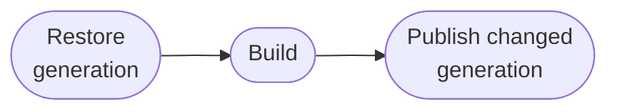
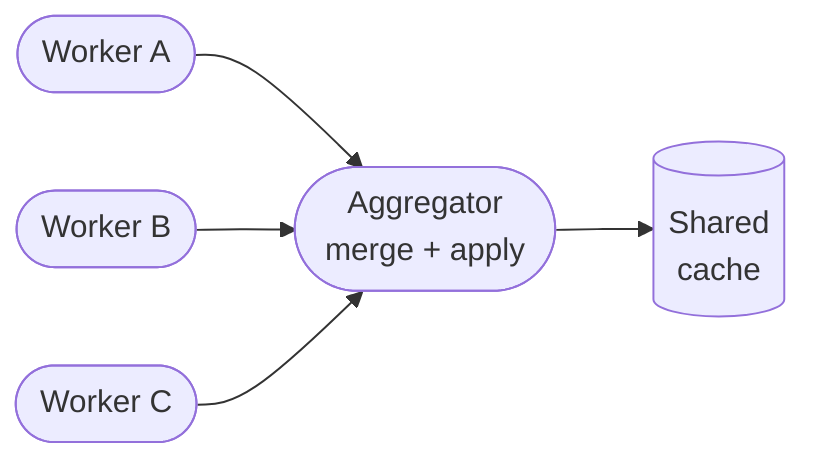

<!--
Copyright 2026 The Buildish Authors

Licensed under the Apache License, Version 2.0 (the "License");
you may not use this file except in compliance with the License.
You may obtain a copy of the License at

    http://www.apache.org/licenses/LICENSE-2.0

Unless required by applicable law or agreed to in writing, software
distributed under the License is distributed on an "AS IS" BASIS,
WITHOUT WARRANTIES OR CONDITIONS OF ANY KIND, either express or implied.
See the License for the specific language governing permissions and
limitations under the License.
-->

# Mammoth Cache for Gradle® and Apache Maven™

Transparent, incremental dependency caching for Gradle and Maven builds on GitHub Actions —
from simple single-job pipelines to large parallel fan-out workflows.

One action wraps your build step. Before the build, it restores the newest compatible immutable
cache generation. After a material change, a standalone job publishes a new complete generation;
distributed workers instead exchange precise deltas through an aggregator. No manual cache-key
juggling, and unchanged standalone runs publish no duplicate generation.

> **Pre-release status:** Mammoth Cache does not have a published release yet. The links below lead
> to unreleased development documentation. The current source tree does not contain the generated
> action bundles and is not directly installable through a `uses:` reference.

---


[Preview the unreleased development guide](development/user/getting-started/)




_Docs cover workflow usage, configuration, cache-partition behaviour, security notes, and
maintenance guidance._

## Current scope

Mammoth Cache currently targets dependency and build-tool cache orchestration on GitHub Actions;
it is not a general build-output cache, build sandbox, or dependency-provenance verifier.
Distributed use requires a dedicated aggregator job. Other CI providers remain future work.

## Highlights

🔁 **Distributed deltas** — worker artifacts package only files changed relative to their restored
base; the aggregator merges them into a complete generation for later runs.

🔒 **Secure Gradle wrapper provisioning** — wrapper JARs are checksum-validated and
GPG-verified against the official Gradle release signing key before any code runs.

🗂 **Content-fingerprinted cache keys** — changing the cache partition layout automatically
produces a new key lineage; no manual version bumps required.

🧹 **Age-based cleanup** — best-effort timestamp garbage collection removes old managed Gradle and
Maven cache entries before a changed generation is published.

🚫 **Read-only on pull requests** — PRs restore the shared cache but never write back,
keeping the main cache clean by default.

## Single-job and distributed workflows

Mammoth Cache works transparently for both simple and complex pipeline shapes.

### Single-job (standalone)

One action call is all it takes. The action runs transparently before and after your build step.

### Distributed multi-job

Worker jobs run in parallel and each publish a delta artifact. The aggregator job downloads,
merges, and applies them all into a single coherent cache that every future run benefits from.

