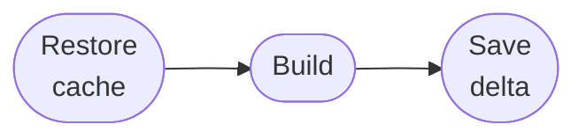

<!--
Copyright 2026 The Apache Software Foundation

Licensed under the Apache License, Version 2.0 (the "License");
you may not use this file except in compliance with the License.
You may obtain a copy of the License at

    http://www.apache.org/licenses/LICENSE-2.0

Unless required by applicable law or agreed to in writing, software
distributed under the License is distributed on an "AS IS" BASIS,
WITHOUT WARRANTIES OR CONDITIONS OF ANY KIND, either express or implied.
See the License for the specific language governing permissions and
limitations under the License.
-->

# Mammoth Cache for Gradle and Maven

**Transparent, incremental dependency caching for Gradle and Maven builds on GitHub Actions —
from simple single-job pipelines to large parallel fan-out workflows.**

One action wraps your build step. Before the build it restores a warm cache; after it, it
captures only what changed and writes back a precise delta. No manual cache-key juggling, no
stale entries from unrelated jobs, no wasted re-uploads of files that haven't moved.

## Highlights

🔁 **Incremental deltas** — only files new or changed since the last build are packaged and
uploaded, keeping artifact sizes small even as the dependency set grows.

🔒 **Secure Gradle wrapper provisioning** — wrapper JARs are checksum-validated and
GPG-verified against the official Gradle release signing key before any code runs.

🗂 **Content-fingerprinted cache keys** — changing the cache partition layout automatically
produces a new key lineage; no manual version bumps required.

🚫 **Read-only on pull requests** — PRs restore the shared cache but never write back,
keeping the main cache clean by default.

## Single-job and distributed workflows

Mammoth Cache works transparently for both simple and complex pipeline shapes.

### Single-job (standalone)

One action call is all it takes. The action runs transparently before and after your build step.

### Distributed multi-job

Worker jobs run in parallel and each publish a delta artifact. The aggregator job downloads,
merges, and applies them all into a single coherent cache that every future run benefits from.

_Docs cover workflow usage, configuration, cache-partition behaviour, security notes, and
maintenance guidance._


